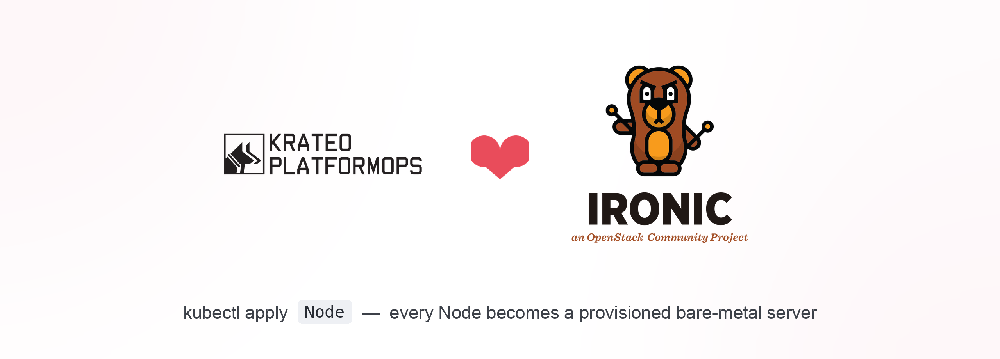

<p align="center">
  
</p>

> 📖 **[Quickstart](docs/quickstart.md)** — install the operator and see a resource appear in Horizon.


# OpenStack Ironic + Krateo (KOG)

Provision bare metal servers with OpenStack Ironic using Krateo's dynamic controllers
instead of a hand-written operator.

- **KOG (Krateo Operator Generator)** — `oasgen-provider` + RestDefinitions generate CRDs and
  `rest-dynamic-controller`s that talk to the Ironic API. Two RestDefinitions, each adherent to
  the Ironic API:
  - **`Node`** → CRUD on `/v1/nodes` (`manifests/restdefinition-node.yaml`).
  - **`NodeProvision`** → the provision action `PUT /v1/nodes/{id}/states/provision`
    (`manifests/restdefinition-provision.yaml`). Creating a `NodeProvision` fires the PUT once
    (a `202` sets a Pending condition that prevents re-firing).
- **Composition** — `core-provider` + a `CompositionDefinition` run the
  `charts/baremetal-lifecycle` Helm chart. The state machine is modeled as **one custom
  resource per state**: the chart renders the `Node` CR plus a single `NodeProvision` CR for the
  node's *current* `provision_state`, selected by the Helm `lookup` function. **composition-dynamic-controller
  re-evaluates `lookup` on every reconcile**, rendering the next transition and pruning the
  previous one, walking `enroll → manage → manageable → provide → available → deploy → active`.
  The composition *is* the orchestrator (no CLI, no middleware service); all transitions go
  through the Ironic API via KOG.

## Free local test environment

Everything runs locally on a laptop for free — no hardware, PXE, VMs, or public cloud.
An isolated `kind` cluster runs Krateo and a standalone Ironic (the official openstack-helm
image `quay.io/airshipit/ironic` with the `fake-hardware` driver, SQLite, noauth). See
[`local/README.md`](local/README.md).

```bash
make local-up        # kind + standalone Ironic + Krateo (KOG + core) + RestDefinition
make provision-demo  # composition provisions a sample fake node 'server01' -> active
make local-down      # tear down
```

All `kubectl`/`helm` use an isolated kubeconfig (`local/kubeconfig.ironic-kog`) and explicit
`--context kind-ironic-kog`, so your default `~/.kube/config` is never touched.

> The standalone Ironic pod includes an nginx sidecar that injects a default
> `X-OpenStack-Ironic-API-Version` header — Ironic rejects write requests without a
> microversion (HTTP 406), and the rest-dynamic-controller doesn't send one.

## Project layout

| Path | Description |
|------|-------------|
| `oas/ironic-node.yaml` | OpenAPI spec for Node CRUD (KOG input) |
| `oas/ironic-provision.yaml` | OpenAPI spec for the provision action (KOG input) |
| `oas/ironic-port.yaml` | OpenAPI spec for Port CRUD (NIC on a node) |
| `oas/ironic-portgroup.yaml` | OpenAPI spec for Portgroup CRUD (bonded NICs) |
| `oas/ironic-allocation.yaml` | OpenAPI spec for Allocation CRUD (node matching/binding) |
| `oas/ironic-deploy-template.yaml` | OpenAPI spec for Deploy Template CRUD (trait -> deploy steps) |
| `manifests/restdefinition-node.yaml` | RestDefinition: Node CRUD |
| `manifests/restdefinition-provision.yaml` | RestDefinition: NodeProvision action |
| `manifests/restdefinition-port.yaml` | RestDefinition: Port (`Port`) |
| `manifests/restdefinition-portgroup.yaml` | RestDefinition: Portgroup (`PortGroup`) |
| `manifests/restdefinition-allocation.yaml` | RestDefinition: Allocation (`Allocation`) |
| `manifests/restdefinition-deploy-template.yaml` | RestDefinition: Deploy Template (`DeployTemplate`) |
| `manifests/compositiondefinition-baremetal-lifecycle.yaml` | CompositionDefinition for core-provider |
| `manifests/baremetallifecycle-example.yaml` | Example composition instance |
| `charts/baremetal-lifecycle/` | Helm chart: Node + NodeConfiguration + per-state NodeProvision CRs |
| `local/` | Free local env (kind config, standalone Ironic, kubeconfig isolation) |
| `deploy/` | openstack-helm Ironic deployment (full stack, for real clusters) |
| `scripts/` | OAS ConfigMap creation, Ironic smoke test |

## Makefile targets

Local env: `local-up`, `krateo-up`, `restdef-up`, `ironic-up`, `provision-demo`,
`ironic-forward`, `smoke-test`, `local-down` (run `make help`).

Chart/packaging: `package-chart`, `template-chart`, `validate-chart`.

## Driving it with composition-dynamic-controller

This is the real flow (the state machine is lookup-driven, so it needs the controller's
repeated reconciles — a single `helm install` only advances one step):

```bash
make composition-up    # package + host the chart, apply the CompositionDefinition
make composition-demo  # create a BaremetalLifecycle instance; cdc walks it to active
# watch:
kubectl -n openstack get node.baremetal.ogen.krateo.io metal-a -o jsonpath='{.status.provision_state}'
```

`composition-up` serves the chart from an in-cluster nginx (`make chart-host`) and points the
CompositionDefinition at it; `core-provider` then generates a `BaremetalLifecycle` CRD +
controller. For a real cluster, publish the `.tgz` (`make package-chart`) to HTTP/OCI and set
`spec.chart.url` in `manifests/compositiondefinition-baremetal-lifecycle.yaml`.

> Pacing: progression is gated by KOG's Node-controller status resync (~tens of seconds per
> state), so a full enroll→active walk takes a few minutes against the fake driver.

`make provision-demo` is a lighter alternative that simulates reconciles with repeated
`helm upgrade` (no CompositionDefinition needed).

## Against a real Ironic API

Two paths, neither needs operator changes:

- **Standalone Ironic on a Linux host (Bifrost)** — real PXE deploys to libvirt VMs as virtual
  bare metal, no Keystone/Glance/Nova. `make bifrost-up BIFROST_URL=http://<host>:6385`.
  Full quickstart: **[docs/BIFROST.md](docs/BIFROST.md)**.
- **Keystone-protected Ironic (e.g. OpenMetal)** — auth proxy authenticates with your
  `clouds.yaml`. `make openmetal-proxy-up CLOUDS_FILE=clouds.yaml OS_CLOUD=<name>`. Full
  step-by-step: **[docs/REAL-IRONIC.md](docs/REAL-IRONIC.md)**.

## Troubleshooting

**State machine not progressing** — the transitions are gated by `lookup` of the Node CR's
`status.provision_state`. If the Node CR is in `Synced=ReconcileError`, status stops updating
and the walk stalls. Check `kubectl -n openstack get node.baremetal.ogen.krateo.io <name>
-o jsonpath='{.status.conditions}'`. (This is why the Node RestDefinition has no `update` verb —
Ironic PATCH is JSON-Patch-only and 400s.) Otherwise it's just slow (KOG status resync ~tens of
seconds per state).

**NodeProvision fires the PUT repeatedly** — it shouldn't; the `202` Pending condition guards
re-firing. Ensure the OAS provision response is `202` and there is no `get` verb on the
NodeProvision RestDefinition.

**Node CR `create failed: 406`** — Ironic needs the microversion header; ensure the nginx
sidecar is running (`kubectl -n openstack get pod -l app=ironic` shows 2/2) or that the
NodeConfiguration sets `X-OpenStack-Ironic-API-Version`.

**Node CR `observe failed: 400`** — the path identifier must map to `spec.name`
(Ironic resolves `/v1/nodes/{name}`); see `manifests/restdefinition-node.yaml`.

**RestDefinition not Ready / CRD not regenerating** — config changes need a fresh generation:
`kubectl delete -f manifests/restdefinition-node.yaml`, restart `krateo-oasgen-provider`,
delete the stale `nodes`/`nodeconfigurations` CRDs, then re-apply.
