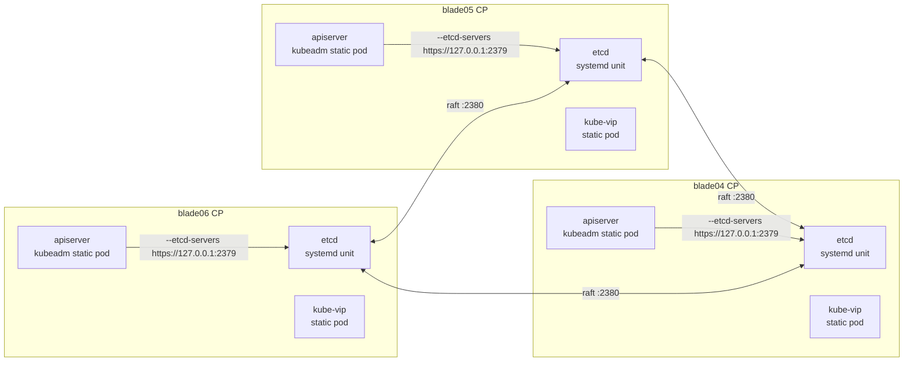
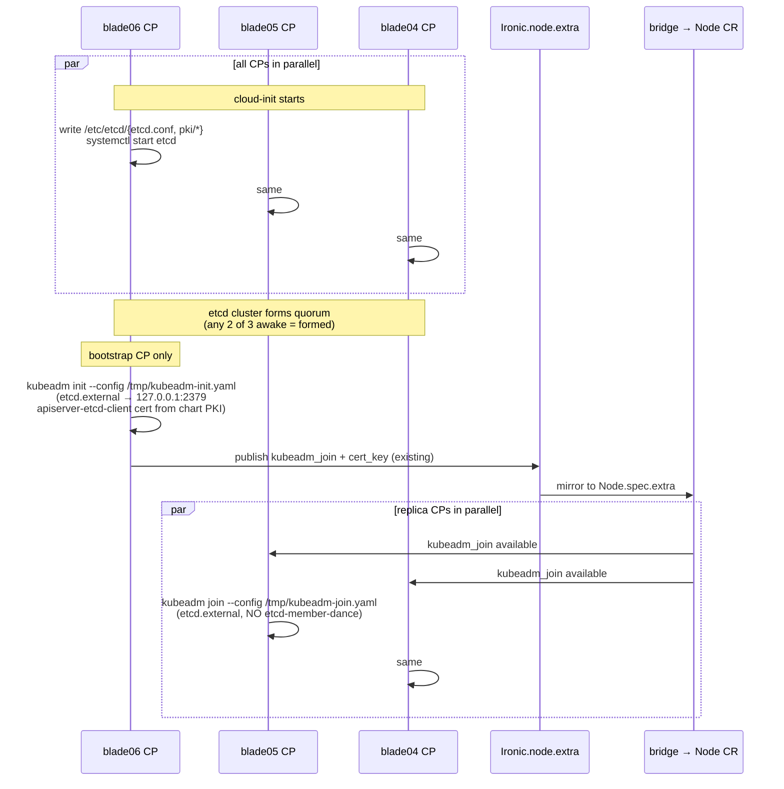

# kubernetes-cluster v0.11.0 — External etcd, static bootstrap

Status: **DRAFT**, awaiting acceptance. Reframes etcd lifecycle as host
substrate (systemd unit on each CP) independent of kubeadm. Eliminates
the `kubeadm join --control-plane` etcd-member-dance that v0.10.15
cannot self-heal.

## The problem v0.10.15 cannot solve in-chart

`kubeadm join --control-plane` against an existing stacked-etcd cluster
runs an `etcd-join` phase that announces the new member to the live
cluster's member list (writing a peer URL into etcd as `unstarted`) and
then waits for the local etcd static pod to transition the member to
`started`. If that wait times out, the announce already mutated the
cluster — the next retry collides with the ghost, and `kubeadm reset`
cannot clean remote state.

We observed this twice on blade05 / blade04 during the v0.10.15 HA test.
Manual `etcdctl member remove <ghost>` unblocks individual retries, but
the chart's reconcile loop just creates a new ghost on the next attempt.
v0.10.15 watcher confirmed 4/6 Ready locked-in for 15+ minutes with
`etcd_members=2` (1 started + 1 ghost) oscillating.

The root issue is **kubeadm's coupling of cluster-join and
etcd-member-join into a single non-idempotent operation**. v0.11.0
breaks the coupling by moving etcd out from under kubeadm entirely.

## Target topology — raw etcd as systemd, kubeadm with `etcd.external`



Failure-domain locality matches today's stacked etcd. Difference:
**etcd is a host systemd unit, not a k8s static pod**. Its lifecycle is
independent of kubeadm and uses static-cluster bootstrap (every member
knows the full member list at boot via `initial-cluster=`).

## Static-bootstrap is symmetric — no bootstrap/replica asymmetry for etcd

The original etcdadm-based draft had blade06 init etcd, then blade05/04
join it via rendezvous. That asymmetry is unnecessary for a known
3-member cluster. With static bootstrap:

- All 3 CPs render the **same** etcd config (modulo `name=` and own
  `listen-*-urls=`).
- All 3 list each other in `initial-cluster=`:
  ```
  initial-cluster: blade06=https://172.19.74.194:2380,blade05=https://172.19.74.140:2380,blade04=https://172.19.74.139:2380
  initial-cluster-state: new
  ```
- All 3 start their etcd systemd unit in parallel.
- Each etcd polls peers until quorum (2 of 3) forms; raft elects a
  leader. Order doesn't matter — whichever boots first waits, the
  second triggers quorum.

Result: **etcd cluster comes up with zero rendezvous**. No "bootstrap
first, replicas wait" dance. Cloud-init on all 3 CPs is symmetric for
the etcd portion.

## Bootstrap sequence (kubeadm portion is still bootstrap-then-replica)



Key shift: **the etcd cluster doesn't depend on kubeadm rendezvous at
all**. It's already up before bootstrap CP runs `kubeadm init`. Replica
CPs' `kubeadm join` skips the etcd-join phase entirely (because
`etcd.external` is configured) — pure idempotent control-plane join.

## PKI — Helm renders at template time, reuse via `lookup`

Per-cluster etcd CA + per-member certs generated by Helm:

```gotemplate
{{- $secretName := printf "%s-etcd-pki" .Release.Name -}}
{{- $existing := lookup "v1" "Secret" .Release.Namespace $secretName -}}
{{- $caCert := "" -}}
{{- $caKey := "" -}}
{{- if $existing }}
  {{- $caCert = b64dec (index $existing.data "ca.crt") -}}
  {{- $caKey = b64dec (index $existing.data "ca.key") -}}
{{- else }}
  {{- $ca := genCA (printf "etcd-%s" .Release.Name) 3650 -}}
  {{- $caCert = $ca.Cert -}}
  {{- $caKey = $ca.Key -}}
{{- end -}}
```

`lookup` returns the existing Secret on reconcile, so the CA stays
stable across chart applies (otherwise every reconcile would rotate
certs and break the running etcd cluster). Per-member certs derived
from the stable CA — same pattern, also looked-up-and-reused.

Cert distribution:

| Material | Generated by | Stored in | Mounted at |
|---|---|---|---|
| etcd CA cert + key | Helm `genCA`, reused via `lookup` | `<release>-etcd-pki` Secret | cloud-init writes to `/etc/etcd/pki/ca.{crt,key}` on each CP |
| Per-member etcd server/peer cert | Helm `genSignedCert` (per-CP, with OOB IP in SAN) | same Secret | cloud-init writes to `/etc/etcd/pki/server.{crt,key}` |
| apiserver-etcd-client cert | Helm `genSignedCert` (no SAN, common-name only) | same Secret | cloud-init writes to `/etc/kubernetes/pki/apiserver-etcd-client.{crt,key}` (where kubeadm expects it) |

No rendezvous through Ironic.node.extra for any of this — everything
comes from the chart Secret, baked into cloud-init at template time.

## Hard constraint: etcd peer URLs use the OOB NIC only

Today's bug came from kubeadm defaulting peer URLs to the
default-route IP, which is the data NIC (192.168.0.x). v0.11.0 pins:

- `listen-peer-urls: https://<OOB_IP>:2380`
- `initial-advertise-peer-urls: https://<OOB_IP>:2380`
- `listen-client-urls: https://127.0.0.1:2379,https://<OOB_IP>:2379`

`OOB_IP` is derived in cloud-init from `VIP_PREFIX` (same logic that
backs kube-vip's `ADVERTISE_IP`). The data NIC's DHCP lease is volatile
across reboots; OOB is stable. Hard-pin makes the cluster
reboot-resilient.

Per-CP IP must be **rendered into the etcd config at chart template
time** (not derived at runtime) because `initial-cluster=` is global —
every member needs to know every other member's peer URL up front. The
chart already has CP nodeUuids; it derives OOB IPs via a `lookup` of
the corresponding Node CR's `status.ipAddress` (set by the bridge
sidecar during the existing provisioning flow). Chicken-and-egg:
chart-template-time needs IPs that the bridge only writes after node
provisioning. Solution: a **2-pass apply** — first pass renders nodes
without etcd config, bridge populates IPs, second pass re-renders with
etcd config and the actual cluster bootstrap runs. This is the same
2-pass pattern the chart already uses for kubeadm_join rendezvous, so
no new infrastructure.

Alternative considered: discover OOB IPs from the chart's
ports/MACs via Redfish DHCP lookups at template time. Rejected: adds
external API dependency at template time, hard to fail-fast.

## Snapshot CronJob in v0.11.0 (not deferred)

~30 lines of YAML, real backup story for half a day of effort:

```yaml
apiVersion: batch/v1
kind: CronJob
metadata:
  name: etcd-snapshot
  namespace: kube-system
spec:
  schedule: "0 */6 * * *"
  jobTemplate:
    spec:
      template:
        spec:
          hostNetwork: true
          nodeSelector:
            node-role.kubernetes.io/control-plane: ""
          tolerations:
            - { key: node-role.kubernetes.io/control-plane, operator: Exists }
          containers:
            - name: etcdctl
              image: registry.k8s.io/etcd:3.6.4
              command:
                - /bin/sh
                - -c
                - |
                  SNAP=/var/lib/etcd-backups/etcd-$(date +%s).snap
                  etcdctl --endpoints=https://127.0.0.1:2379 \
                    --cacert=/etc/etcd/pki/ca.crt \
                    --cert=/etc/etcd/pki/server.crt \
                    --key=/etc/etcd/pki/server.key \
                    snapshot save "$SNAP"
                  find /var/lib/etcd-backups -name "etcd-*.snap" \
                    -mtime +7 -delete
              volumeMounts:
                - { name: etcd-pki, mountPath: /etc/etcd/pki, readOnly: true }
                - { name: backups,  mountPath: /var/lib/etcd-backups }
          volumes:
            - { name: etcd-pki, hostPath: { path: /etc/etcd/pki } }
            - { name: backups,  hostPath: { path: /var/lib/etcd-backups, type: DirectoryOrCreate } }
          restartPolicy: OnFailure
```

Snapshots land on the CP's local disk (hostPath), kept 7 days. Triple-
blade loss still means redeploy, but single/double blade loss is
recoverable from any surviving CP's snapshot via `etcdctl snapshot
restore`. v0.11.1 can layer in remote-copy via the bridge sidecar.

Documented restore runbook in `docs/RUNBOOK-ETCD-RESTORE.md` (separate
PR).

## Chart shape — what changes

### `controlPlane.etcd` values block (new, minimal)

```yaml
controlPlane:
  endpoint: "172.19.74.51:6443"
  etcd:
    # etcd binary comes from Debian 13 trixie apt as etcd-server.
    # 3.5.16-4 is the apt candidate; pin explicitly here so future
    # Debian updates don't silently move us. Override only if you
    # need a specific build.
    aptPackage: "etcd-server=3.5.16-4"
    # Image for the snapshot CronJob's etcdctl. Must match etcd minor.
    # gcr.io/etcd-development/etcd ships matching tags.
    snapshotImage: "gcr.io/etcd-development/etcd:v3.5.16"
    snapshotSchedule: "0 */6 * * *"
    snapshotRetentionDays: 7
  nodes: [ ... ]                       # unchanged
```

**Version compat verified** (resolves Risk #1 + #2 from earlier draft):

| Component | Version | Source |
|---|---|---|
| kube-apiserver, kubeadm | 1.36.2 | (user-supplied via spec.k8sVersion) |
| kubeadm 1.36 stacked-etcd default | 3.6.8-0 | k8s upstream `SupportedEtcdVersion` map |
| Our external etcd pin | 3.5.16-4 | Debian 13 trixie apt `etcd-server` |
| Wire protocol compat | etcd v3 gRPC | stable since etcd 3.0 — no breaking changes 3.5 → 3.6 |

Apiserver may log a benign "client/server version mismatch" warning;
cosmetic. The storage path (mvcc bbolt) is unchanged across 3.5/3.6.

### `cpUserData` (bootstrap CP) — new sections

`write_files`:
- `/etc/etcd/pki/ca.crt`, `ca.key` (from chart PKI Secret)
- `/etc/etcd/pki/server.crt`, `server.key` (per-CP, OOB IP in SAN)
- `/etc/kubernetes/pki/apiserver-etcd-client.crt`, `.key` (kubeadm path)
- `/etc/etcd/etcd.conf` (Helm-rendered with `initial-cluster=` listing all 3)
- `/etc/systemd/system/etcd.service` (raw etcd binary, --config-file)
- `/etc/kubernetes/kubeadm-init.yaml` (full `InitConfiguration` +
  `ClusterConfiguration` with `etcd.external` pointing at
  `https://127.0.0.1:2379`, cert paths matching chart PKI)

`runcmd`:
1. (Existing) wait for network, install containerd, kubelet
2. **NEW**: install etcd (`apt-get install -y etcd-server` on Debian 13;
   verify available version pre-merge)
3. **NEW**: `systemctl enable --now etcd`
4. **NEW**: wait for etcd quorum (`etcdctl endpoint status` returns
   healthy)
5. (Existing) `kubeadm init --config /etc/kubernetes/kubeadm-init.yaml`
6. (Existing) publish-kubeadm-join, publish-workload-kubeconfig

### `cpReplicaUserData` (replicas) — simplified

`write_files`: same etcd material as bootstrap, plus:
- `/etc/kubernetes/kubeadm-join.yaml` (`JoinConfiguration` +
  `controlPlane.localAPIEndpoint`, `etcd.external` config — kubeadm
  skips etcd-member-dance because etcd is external)

`runcmd`:
1. (Existing) install containerd, kubelet
2. **NEW**: install + start etcd (identical to bootstrap)
3. **NEW**: wait for etcd quorum
4. (Existing) wait-for-kubeadm-cert-key (from Node.spec.extra)
5. **NEW** (replaces existing kubeadm join): `kubeadm join --config
   /etc/kubernetes/kubeadm-join.yaml` — idempotent now, no
   member-dance, the 30-iteration retry loop drops to 3.

### `workerUserData` — unchanged

Workers never touched etcd. Verbatim port from v0.10.15.

### What disappears from v0.10.15

- The 30-iteration `kubeadm reset --force --cleanup-tmp-dir` retry loop
  in replica join.sh — the underlying failure mode is gone.
- The etcd ghost-cleanup runbook (manual `etcdctl member remove`).
- The chart's `--upload-certs` cert-key publish to Ironic.node.extra is
  unchanged in scope but no longer load-bearing for etcd (only for
  kubeadm certs).

### What stays from v0.10.15

- kube-vip static-pod write_file flow (VIP across CP apiservers).
- VIP_PREFIX-based ADVERTISE_IP / VIP_IFACE derivation.
- workload-kubeconfig publish flow.
- bridge sidecar (unchanged — no new fields).
- cgroup-driver alignment (`SystemdCgroup=true` in containerd config).

## Failure modes — before and after

| Failure | v0.10.15 (stacked) | v0.11.0 (external etcd) |
|---|---|---|
| Replica's first kubeadm join fails mid-etcd-member-announce | Ghost persists, blocks all retries forever. Manual `etcdctl member remove` required per ghost. | Doesn't happen. etcd already running. kubeadm join is idempotent retry-safe. |
| Bootstrap CP dies mid-init | Whole cluster lost. | Same — kubeadm init is bootstrap-CP-only. |
| Replica CP dies mid-join | `etcdctl` member cleanup + redeploy. | Just redeploy. etcd cluster keeps 2/3 quorum. |
| Bootstrap CP rebooted after init | Stacked etcd recovers via kubelet. | systemd restarts etcd, kubelet restarts apiserver. About the same. |
| One CP loses OOB network | etcd quorum survives 1-of-3 loss. | Same. |
| Two CPs die simultaneously | etcd loses quorum, cluster read-only. | Same. |
| All 3 CPs die simultaneously | Full redeploy, no recovery (no backups). | Restore from CronJob snapshot if any surviving CP disk intact. |
| etcd CA expiry | `kubeadm certs renew` covers it. | Manual procedure (documented), v0.11.1 may automate. |

## Risks and unknowns to verify before code

1. ~~**Debian 13 etcd-server package version.**~~ RESOLVED: trixie apt
   ships `etcd-server 3.5.16-4`. Clean apt install, no GH-release
   fetch needed.
2. ~~**k8s 1.36 + etcd 3.6.x compatibility.**~~ RESOLVED: kubeadm 1.36
   stacks 3.6.8-0 by default but kube-apiserver uses the wire-stable
   etcd v3 gRPC protocol that works against 3.5.x external etcd
   without breakage. Confirmed via kubeadm `SupportedEtcdVersion` map
   and etcd's storage version stability docs.
3. **2-pass apply for OOB IP discovery.** New chart needs to handle
   "first apply has no IPs, second apply renders etcd config." This is
   the same pattern as kubeadm_join rendezvous, but for etcd the
   chicken-and-egg is **at chart-template time, not at runtime**. Need
   to verify Helm's `lookup` returns the right state on the second
   apply. Mitigation: render `initial-cluster=` from `controlPlane.nodes[*].oobIp`
   if set in values; auto-discover only if absent. Falls back to
   user-supplied IPs for full determinism.
4. **etcd CA renewal procedure.** v0.11.0 ships with manual runbook.
   Risk: someone forgets to rotate, CA expires after 10 years (low
   urgency but real). Queue automated job for v0.11.1.
5. **First-time chart apply + cdc reconcile interaction.** cdc may
   re-run helm install before bridge has populated IPs. Chart must
   handle gracefully (skip etcd config rendering until IPs available,
   render placeholder Secret to keep chart valid). Same as existing
   kubeadm_join lookup-with-default pattern.

## Implementation plan

| Step | Description | Effort |
|---|---|---|
| 1 | Helm-rendered PKI: new `_helpers.tpl` block for `genCA`+`lookup` pattern, render `<release>-etcd-pki` Secret | 0.5d |
| 2 | etcd cloud-init: install + write conf/certs/systemd unit, both CP user-datas symmetrically | 0.5d |
| 3 | kubeadm config files: replace CLI flags with `--config kubeadm-init.yaml` / `kubeadm-join.yaml`, add `etcd.external` block | 0.5d |
| 4 | OOB IP discovery: 2-pass apply pattern, `lookup` on Node CR `status.ipAddress`, render `initial-cluster=` from collected IPs | 0.3d |
| 5 | Snapshot CronJob template + values | 0.2d |
| 6 | Remove kubeadm-reset retry loop from replica join.sh; shrink to 3 idempotent attempts | 0.1d |
| 7 | E2E test on lab: deploy `ettore-ha` at `composition.krateo.io/v0-11-0`, verify 6/6 Ready, etcd quorum 3/3, kill one CP, verify cluster survives, restore from snapshot | 0.5d |
| 8 | Update `kagent/agent-ironic-expert.yaml` systemMessage with v0.11.0 cheat-sheet + etcd-debug runbooks | 0.2d |
| 9 | Update `docs/KUBERNETES-CLUSTER.md` with new layered architecture (etcd as host substrate) | 0.2d |
| 10 | Add `docs/RUNBOOK-ETCD-RESTORE.md` for snapshot restore procedure | 0.2d |

Total: ~3 days, single-threaded.

## Out of scope for v0.11.0

- Automated etcd CA renewal (queue for v0.11.1)
- Remote-copy of snapshots (mgmt cluster, S3, NFS — queue for v0.11.1)
- In-place upgrade from v0.10.x (tear-down + redeploy is the supported
  migration; document)
- Multi-tenant Krateo with shared etcd-operator (architecturally
  rejected in design discussion)
- External-cluster etcd (etcd outside the workload cluster's failure
  domain) — different topology, separate design
- Dedicated etcd blades (3-CP + 3-etcd topology) — values knob in a
  future release if a tenant asks for the blast-radius separation
