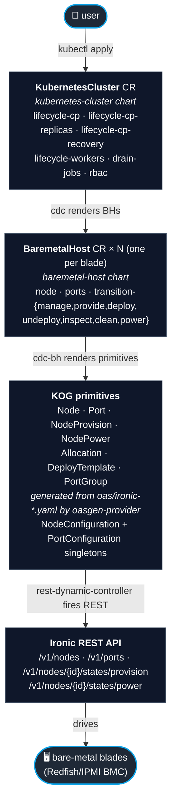
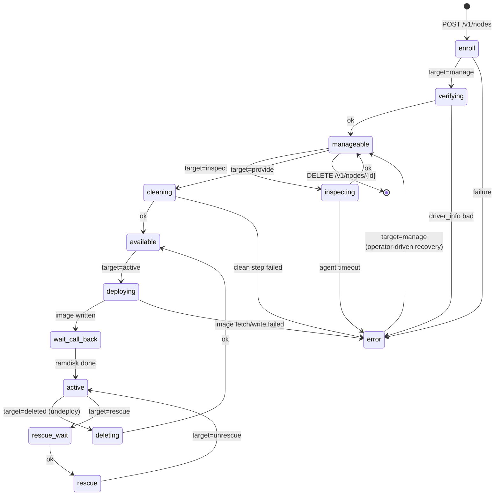
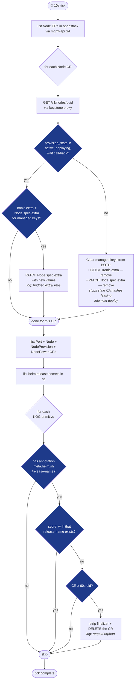
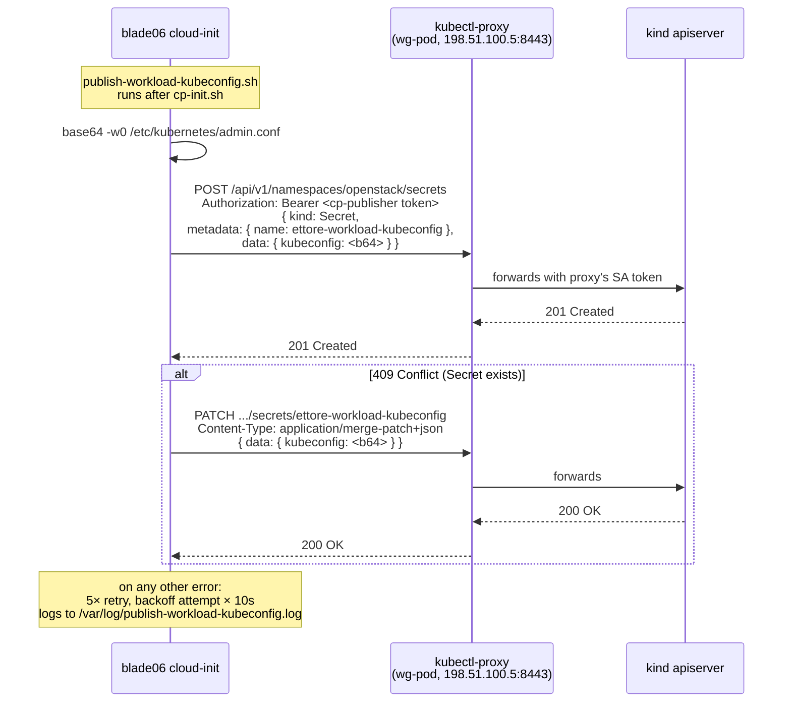
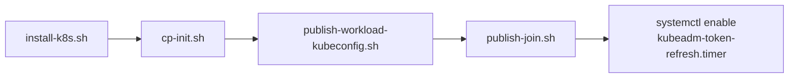
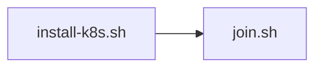

# `kubernetes-cluster` composition

Provision a real Kubernetes cluster on Ironic-managed bare-metal nodes by applying **one** Custom Resource. No Go operator, no extra controllers — a layered Krateo composition that decomposes into well-known primitives and ends up calling Ironic's REST API.

## Table of contents

- [Layered architecture](#layered-architecture)
- [Ironic provision-state FSM](#ironic-provision-state-fsm)
- [Cluster bringup — sequence diagram](#cluster-bringup--sequence-diagram)
- [The rendezvous: how the worker finds the CP](#the-rendezvous-how-the-worker-finds-the-cp)
- [Bridge sidecar — state machine](#bridge-sidecar--state-machine)
- [Workload kubeconfig delivery (v0.10.13)](#workload-kubeconfig-delivery-v01013)
- [What each embedded script does](#what-each-embedded-script-does)
- [Spec reference](#spec-reference)
- [Day-2 operations](#day-2-operations)
- [Accessing the provisioned cluster](#accessing-the-provisioned-cluster)
- [Troubleshooting playbook](#troubleshooting-playbook)
- [Related docs](#related-docs)

---

## Layered architecture

Every chart below ships its own [`CompositionDefinition`](https://docs.krateo.io/key-concepts/composition-definition/); Krateo's `composition-dynamic-controller` (cdc) turns each CR into a Helm release at the next layer down.



The siblings `BaremetalLifecycle` and `BaremetalDiscovery` ship separate composition charts that target the same L2 primitives at narrower scopes — `BaremetalLifecycle` is a slim `enroll → active` with no rebuild lifecycle, `BaremetalDiscovery` is a manage + inspect pass that surfaces inventory in `Node.status` for an operator to consume. `kubernetes-cluster` only renders `BaremetalHost` directly because it needs the full state machine.

---

## Ironic provision-state FSM

KOG's `NodeProvision` rdc drives Ironic through the state machine by `PUT`ing a `target` on `/v1/nodes/{id}/states/provision`. The `baremetal-host` chart renders one `NodeProvision` CR per transition, gated on the current `provision_state`.



The chart's `lifecycle-cp.yaml` template renders the BH with `spec.image`, `configDrive`, and `online: true`. KOG walks the state machine forward automatically; the chart only re-renders to inject the right `NodeProvision` per state.

---

## Cluster bringup — sequence diagram

End-to-end on a fresh apply of `KubernetesCluster ettore`. Real timing measured on the Ettore lab, Debian 13 trixie, k8s 1.36.2: **23-24 min hands-off, 0 pod restarts** (since v0.10.12 aligned cgroup drivers).

```mermaid
sequenceDiagram
  actor user as 👤 user
  participant mgmt as Mgmt cluster (kind)
  participant ironic as 🛢️ Ironic
  participant cp as blade06 (CP)
  participant worker as blade10 (worker)

  user->>mgmt: kubectl apply KubernetesCluster ettore
  Note over mgmt: cdc helm-installs<br/>kubernetes-cluster chart

  mgmt->>mgmt: renders ettore-cp-blade06 BH
  Note over mgmt: cdc-bh helm-installs<br/>baremetal-host chart →<br/>Node + Port×2 + NodeProvision

  mgmt->>ironic: POST /v1/nodes (blade06)
  mgmt->>ironic: POST /v1/ports × 2
  mgmt->>ironic: PUT manage
  Note over ironic: enroll → verifying → manageable
  mgmt->>ironic: PUT provide
  Note over ironic: cleaning → available
  mgmt->>ironic: PUT active + configdrive
  Note over ironic: deploying → wait call-back → active
  ironic->>cp: ✨ boot with cloud-init

  cp->>cp: install-k8s.sh<br/>(containerd cfg + SystemdCgroup=true)
  cp->>cp: cp-init.sh<br/>(kubeadm init + flannel)
  cp->>mgmt: POST Secret<br/>ettore-workload-kubeconfig
  cp->>ironic: PATCH node.extra<br/>{kubeadm_join, cert_key}

  loop every 10s
    mgmt->>ironic: GET /v1/nodes/blade06<br/>(bridge sidecar)
  end
  mgmt->>mgmt: PATCH Node.spec.extra<br/>(bridge mirrors)
  Note over mgmt: cdc re-reconciles ettore CR;<br/>joinCommand lookup resolves;<br/>renders ettore-worker-blade10 BH

  mgmt->>ironic: POST /v1/nodes (blade10) + ports
  mgmt->>ironic: PUT active + worker configdrive
  Note over ironic: deploying → active
  ironic->>worker: ✨ boot

  worker->>worker: install-k8s.sh
  worker->>worker: join.sh (30 × 20s retry)
  worker->>cp: kubeadm join 192.168.0.206:6443
  Note over cp,worker: TLS handshake + bootstrap

  cp-->>user: blade06 Ready + blade10 Ready<br/>(via ettore-workload-kubeconfig)
```

---

## The rendezvous: how the worker finds the CP

The bare-metal blade can reach Ironic on the lab's OOB network, but it CAN'T reach the management cluster directly — the WG tunnel routes mgmt → lab, not the reverse. So the worker's `kubeadm join …` command must be embedded in its userData at chart-render time, but that command doesn't exist until the CP has run `kubeadm init`.

The chart resolves the chicken-and-egg through **Ironic `node.extra` as a publish-board**, plus a bridge sidecar that mirrors back into the management cluster:

```mermaid
sequenceDiagram
    participant cp as blade06 (CP)
    participant ironic as 🛢️ Ironic node.extra
    participant bridge as bridge sidecar<br/>(wg-pod)
    participant nodecr as Node CR<br/>(mgmt cluster)
    participant cdc as cdc-kubernetes-cluster
    participant wbh as ettore-worker-blade10 BH

    cp->>ironic: 1️⃣ publish-join.sh PATCH<br/>extra: { kubeadm_join, cert_key }

    loop every 10s
      bridge->>ironic: 2️⃣ GET /v1/nodes/blade06
      ironic-->>bridge: extra: {...}
    end

    bridge->>nodecr: 3️⃣ PATCH spec.extra<br/>(mirrors Ironic.extra)

    Note over cdc: natural reconcile cadence;<br/>helm-templates the chart;<br/>joinCommand lookup<br/>now finds Node.spec.extra<br/>.kubeadm_join

    cdc->>wbh: 4️⃣ renders BH with<br/>kubeadm join 192.168.0.206:6443<br/>--token ... --discovery-token-ca-cert-hash ...<br/>embedded in spec.configDrive.userData
```

The publish-board pattern means the worker BH simply doesn't render until the CP has published. The cdc picks up the bridged value on its next reconcile.

For HA the same pattern carries `cert_key` — the encryption key for kubeadm's `kubeadm-certs` Secret, so replica CPs can `kubeadm join --control-plane --certificate-key`.

---

## Bridge sidecar — state machine

`scripts/ironic-node-extra-bridge.py` runs in the `wg-ironic-proxy` pod alongside the keystone proxy. Two responsibilities, run in every 10s tick:



Logs to inspect: `kubectl -n openstack logs <wg-pod> -c ironic-extra-bridge -f`. Expected log lines: `bridged extra keys ['kubeadm_join', 'cert_key'] from Ironic to CR blade06`, `cleared Ironic.extra keys ['kubeadm_join'] on blade06 (state=available)`, `reaped orphan ports/blade10-00-60-2f-3a-81-01 (release=... not tracked)`.

---

## Workload kubeconfig delivery (v0.10.13)

The CP's cloud-init publishes `/etc/kubernetes/admin.conf` as a Secret in the management cluster, so external users get the workload kubeconfig with one `kubectl` call instead of SSH-scping the file off the blade.



The `<clusterName>-cp-publisher` SA is created by the chart's `rbac.yaml` with `secrets: create, get` in the openstack namespace. Its bearer token is read at helm-template time via `lookup` and baked into the userData — same machinery used by the join-publish path.

The Secret carries:

```yaml
apiVersion: v1
kind: Secret
metadata:
  name: ettore-workload-kubeconfig
  namespace: openstack
  labels:
    kubernetescluster.ogen.krateo.io/cluster: ettore
type: Opaque
data:
  kubeconfig: <base64 of admin.conf>
```

The decoded `admin.conf` server URL is `https://<cp-data-ip>:6443` — the IP `cp-init.sh` pinned via `--apiserver-advertise-address` since v0.10.10.

---

## What each embedded script does

Each script is dropped into the CP's cloud-init `write_files:` by the chart and called from `runcmd:`. The CP runcmd order is:



| Script | Logs to | What it does |
|---|---|---|
| `install-k8s.sh` | `/var/log/install-k8s.log` | apt-install `kubeadm`/`kubelet`/`kubectl`/`containerd`; rewrite `/etc/containerd/config.toml` (`bin_dir=/opt/cni/bin`, **`SystemdCgroup=true`** — fixes the etcd-flap, v0.10.12); restart containerd; switch iptables/ip6tables to `legacy`; `modprobe overlay br_netfilter` + sysctls (`net.ipv4.ip_forward=1`, bridge-nf-call-*) |
| `cp-init.sh` | `/var/log/cp-init.log` | detect `ADVERTISE_IP` from `ip route get 8.8.8.8`; `openssl rand -hex 32 > /etc/kubernetes/cert-key`; `kubeadm init --apiserver-advertise-address=$ADVERTISE_IP` (pinned in v0.10.10 to remove dual-NIC autodetect race); copy `admin.conf` to `/root/.kube/config`; `kubectl apply` flannel |
| `publish-workload-kubeconfig.sh` | `/var/log/publish-workload-kubeconfig.log` | base64 `admin.conf` → POST Secret (or PATCH on 409) to mgmt cluster's openstack namespace as `<clusterName>-workload-kubeconfig`; 5× retry on transient failures (v0.10.13) |
| `publish-join.sh` | `/var/log/publish-join.log` | `kubeadm token create --print-join-command` (24h TTL); Keystone v3 password auth to lab Keystone (system_scope); PATCH `/v1/nodes/<uuid>` with JSON-Patch `add` of `/extra/kubeadm_join` and `/extra/cert_key`; 5× retry |
| `kubeadm-token-refresh.timer` (systemd) | journal | Re-runs `publish-join.sh` every 12h (50% margin under the 24h token TTL) so workers joining beyond day 1 get a valid token |

The worker's runcmd is simpler:



| Script | Logs to | What it does |
|---|---|---|
| `install-k8s.sh` (worker variant) | `/var/log/install-k8s.log` | same as the CP version minus `kubectl` install — `kubeadm`/`kubelet`/`containerd` is enough for a worker |
| `join.sh` | `/var/log/join.log` | 30 × 20s retry loop running the join command embedded by the chart at render time. Was added in v0.10.9 (before v0.10.12 made the flap go away entirely; still useful for any transient CP unreachability). |

---

## Spec reference

### Identity + image

```yaml
spec:
  clusterName: ettore
  k8sVersion: v1.36.2                   # any v1.30+ that pkgs.k8s.io publishes
  image:
    source: http://172.19.74.1:8089/debian-13-genericcloud-amd64.qcow2
    checksum: http://172.19.74.1:8089/CHECKSUM
```

`k8sVersion` is matched to the latest `-X.X` Debian package suffix at install time via `apt-cache madison` (v0.10.11 fix — older minors ship `-1.1`, v1.36+ ships `-2.1`).

### CNI + network

```yaml
spec:
  cni:
    install: flannel
    manifestUrl: https://github.com/flannel-io/flannel/releases/latest/download/kube-flannel.yml
  network:
    podCIDR: 10.244.0.0/16
    serviceCIDR: 10.96.0.0/12
    managementApiReachability: nodeport-dns
```

### Ironic endpoint + auth

```yaml
spec:
  ironicApiUrl: http://ironic.openstack.svc.cluster.local:6385
  ironicApiVersion: "1.81"
  ironicAuth:
    authUrl:    http://172.19.74.1:5000
    ironicUrl:  http://172.19.74.1:6385
    username:   admin
    password:   <…>
    userDomain: Default
  configurationRef:
    name:      ironic-endpoint
    namespace: openstack
```

`ironicApiUrl` + `configurationRef` are what the KOG primitives use to talk to Ironic. `ironicAuth` is what the CP's `publish-join.sh` uses to PATCH Ironic from the blade itself (Keystone auth, system_scope).

### Management-cluster ingress

```yaml
spec:
  managementCluster:
    apiUrl:                  http://198.51.100.5:8443
    serviceAccountName:      ettore-cp-publisher
    serviceAccountNamespace: openstack
```

`apiUrl` is the kubectl-proxy sidecar inside `wg-ironic-proxy`, reachable from the lab through the WG tunnel. The SA and its token-Secret are created by the chart's `rbac.yaml` with `secrets: create,get` and `nodes: get,patch`.

### Control plane

```yaml
spec:
  controlPlane:
    endpoint: ""                                # set for HA (LB hostname)
    node:                                       # bootstrap CP (index 0)
      nodeName: blade06
      nodeUuid: 2f05176e-…
      driver: redfish
      driver_info:
        redfish_address:   http://172.19.74.11:8000
        redfish_system_id: /redfish/v1/Systems/blade06
        redfish_username:  ironic
        redfish_password:  baremetal
        redfish_verify_ca: false
      parentNode: 5113ab44-…
      ports:
        - { address: "00:60:2f:36:81:01", pxe_enabled: true }
        - { address: "00:60:2f:36:81:02", pxe_enabled: false }
    # day-2 levers
    upgrade:
      targetNode: ""                            # set to CP nodeName to re-image
    recovery:
      failedNodes: []
```

### Workers

```yaml
spec:
  workers:
    drainTimeout: 5m
    nodes:
      - nodeName: blade10
        nodeUuid: fcae4724-…
        driver: redfish
        driver_info: { … }
        parentNode: 5113ab44-…
        ports: [ … ]
    removed: []                                 # move entry here to drain+undeploy
```

---

## Day-2 operations

| Goal | What to change in the CR |
|---|---|
| Add a worker | append to `spec.workers.nodes[]` |
| Drain + remove a worker | move entry from `workers.nodes[]` to `workers.removed[]` — the chart renders a drain Job mounting `<cluster>-workload-kubeconfig`, then sets `spec.undeploy: true` on the BH once drain succeeds |
| Add an HA replica CP | append to `spec.controlPlane.nodes[]` — gates on bootstrap CP's `cert_key` being present in the Node CR |
| Reimage a CP for a k8s patch upgrade | set `spec.controlPlane.upgrade.targetNode` to the nodeName; chart re-renders BH with `undeploy: true, undeployMode: full`; clear once Ironic walks back to `available` |
| Recover a failed CP | add nodeName to `spec.controlPlane.recovery.failedNodes` |
| Refresh kubeadm join token | nothing — `kubeadm-token-refresh.timer` re-runs `publish-join.sh` every 12h |
| Rotate the workload-kubeconfig Secret | `kubectl -n openstack delete secret <cluster>-workload-kubeconfig` then annotate the KubernetesCluster CR to nudge cdc; OR just wait for the next CP reboot |

---

## Accessing the provisioned cluster

### Recommended — workload-kubeconfig Secret (v0.10.13)

```sh
kubectl -n openstack get secret <cluster>-workload-kubeconfig \
  -o jsonpath='{.data.kubeconfig}' | base64 -d > my.kubeconfig
sudo chmod 600 ./my.kubeconfig

KUBECONFIG=./my.kubeconfig kubectl get nodes -o wide
```

The decoded server URL is `https://<cp-data-ip>:6443`. Anyone with network access to the data network gets a working kubeconfig.

### Fallback — SSH-tunnel from a workstation that only reaches OOB

```sh
ssh -L 6443:192.168.0.206:6443 ironic@<cp-OOB-ip>

# in another shell — rewrite the server URL in the kubeconfig:
kubectl --kubeconfig=./my.kubeconfig config set-cluster <cluster> \
  --server=https://127.0.0.1:6443 --insecure-skip-tls-verify=true
```

The TLS SAN covers the apiserver's actual IP, so the tunnel breaks SAN verification — `--insecure-skip-tls-verify` is required.

### On-blade — when you're already SSHed in for debugging

```sh
ssh ironic@<cp-OOB-ip>
sudo KUBECONFIG=/etc/kubernetes/admin.conf kubectl get nodes
```

`/root/.kube/config` is the same file (`cp-init.sh` `cp`'d it on first boot).

---

## Troubleshooting playbook

Order matters: top of the table = check first.

| Symptom | Where to look | Often-true root cause |
|---|---|---|
| etcd / apiserver restart counter climbing every ~11s | `grep cgroupDriver /var/lib/kubelet/config.yaml` vs `grep SystemdCgroup /etc/containerd/config.toml` on the CP | cgroup-driver mismatch. Aligned to `systemd` since v0.10.12. If you see it again, the chart's containerd config rewrite was overridden by something. |
| `KubernetesCluster` stuck `Ready: False` | `kubectl -n krateo-system logs deploy/kubernetesclusters-v0-X-X-controller` | core-provider regenerated the cdc; the ettore CR may be at an apiVersion no longer served. Re-apply the manifest with the latest `composition.krateo.io/v0-X-X`. |
| `BaremetalHost` stuck `Synced: False` "exists and cannot be imported" | `kubectl -n openstack get port,nodeprovision,nodepower` for orphans | half-failed prior helm install. Bridge reaper deletes them after 60s (v0.10.8). If reaper isn't running, restart wg pod. |
| Worker never joins, `kubelet.conf` missing on blade10 | `sudo tail /var/log/join.log` on blade10 | apiserver was flapping at join time (pre-v0.10.12) or worker has a stale join command (pre-v0.10.8 bridge clear-on-non-active). |
| Worker has `kubelet.conf` but says `connect: connection refused` | check the CP's apiserver | same etcd-flap cluster of symptoms. v0.10.12 fix should hold. |
| `<cluster>-workload-kubeconfig` Secret missing | `sudo tail /var/log/publish-workload-kubeconfig.log` on CP | SA token wasn't rendered (rbac.yaml race) — re-render BH by annotating the KubernetesCluster CR. |
| `<cluster>-workload-kubeconfig` exists but points at the wrong IP | decode it: `… \| base64 -d \| grep server:` | `--apiserver-advertise-address` resolved to an unexpected NIC. Check `ip route get 8.8.8.8` on the CP — should print the data network IP. |
| Bridge log spams `HTTP Error 403` | the SA's Role is missing a verb | patch `manifests/wg-ironic-proxy.yaml` Role; re-`make lab-tunnel-up`. The bridge needs `get,list,patch,delete` on `nodes,ports,nodeprovisions,nodepowers`. |
| `kubectl get bh -o yaml` shows the OLD `kubeadm_join` after a redeploy | check Ironic `node.provision_state` | bridge clears extra only when state is NOT `{active, deploying, wait call-back}` (v0.10.8). If clearing isn't happening, restart the wg pod. |
| New worker BH never renders even though blade06 is Ready | check Node CR | `Node.spec.extra.kubeadm_join` is the gate. Verify bridge mirrored it; if not, `kubectl -n openstack logs <wg-pod> -c ironic-extra-bridge --tail=30`. |

### Data-driven debug discipline

When a symptom survives one chart cut, the next move is **diagnostics on the live cluster, not the next chart cut**.

Concretely: SSH into the CP, run the relevant `grep`/`journalctl`/`crictl` commands, read the output. The 11-second etcd kill that started this whole journey was visible from `grep cgroupDriver` + `grep SystemdCgroup` in under a minute — we'd burned nine chart cuts speculating before doing that. Don't repeat that mistake.

---

## Related docs

- [USER-GUIDE.md](USER-GUIDE.md) — the `BaremetalHost` spec, transition-by-transition
- [E2E.md](E2E.md) — end-to-end timing breakdown + fixture manifests
- [KUBERNETES-CLUSTER-PLAN.md](KUBERNETES-CLUSTER-PLAN.md) — design rationale, milestones
- [REAL-IRONIC.md](REAL-IRONIC.md) — pointing the operator at a Keystone-protected Ironic
- [ORPHAN-RECOVERY.md](ORPHAN-RECOVERY.md) — the orphan KOG primitive story
- [BIFROST.md](BIFROST.md) — pointing the operator at a remote Bifrost
- [VS-METAL3.md](VS-METAL3.md) — comparison with Metal3
- [quickstart.md](quickstart.md) — bring up the local stack in 5 minutes
