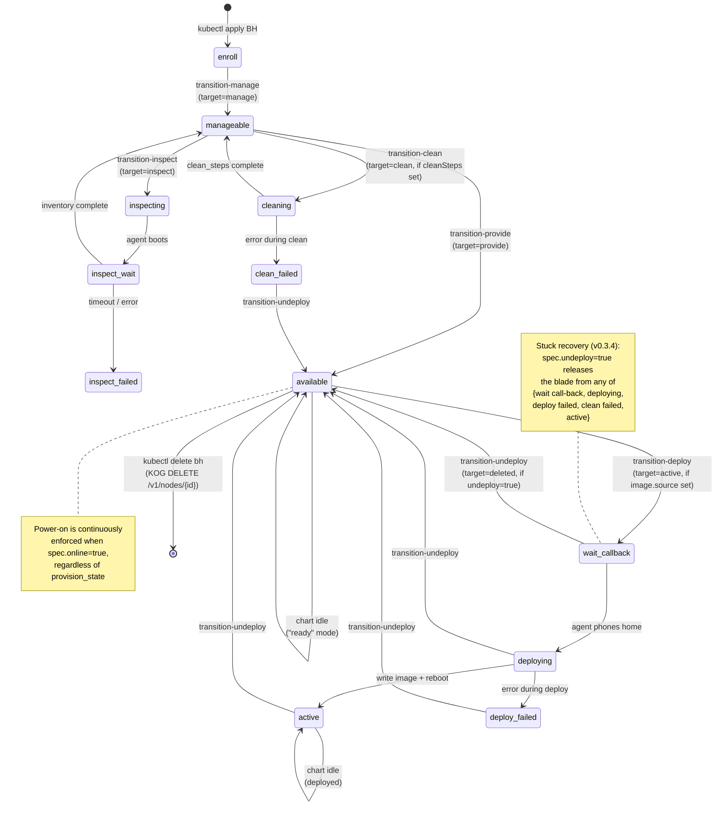

# BaremetalHost composition — user guide

Drive a bare-metal blade through Ironic's lifecycle with a single
`composition.krateo.io/v0-3-4` BaremetalHost CR. The Krateo blueprint
re-renders on every reconcile; each transition fires automatically once
the gates match live Ironic state.

## The two layers, named

There is no Go controller in this repo. The lifecycle is driven by **two
Krateo components stacked on top of each other**, and it helps to keep
them straight in your head.

### Layer 1 — `ironic-operator-kog` (the primitives)

The KOG (Krateo Operator Generator) part. From an OpenAPI spec of the
Ironic REST API (`oas/ironic-*.yaml`) we declare `RestDefinition` CRs
(`manifests/restdefinition-*.yaml`). KOG's `oasgen-provider` consumes
those and generates one CRD + one `rest-dynamic-controller` per resource:

| CRD | Backed by | What 1 CR = |
|---|---|---|
| `nodes.baremetal.ogen.krateo.io` | `ironic-node-controller` | one Ironic node (CRUD on `/v1/nodes`) |
| `ports.baremetal.ogen.krateo.io` | `ironic-port-controller` | one Ironic port (CRUD on `/v1/ports`) |
| `nodeprovisions.baremetal.ogen.krateo.io` | `ironic-node-provision-controller` | one `PUT /v1/nodes/{id}/states/provision` (fires once per CR) |
| `nodepowers.baremetal.ogen.krateo.io` | `ironic-node-power-controller` | one `PUT /v1/nodes/{id}/states/power` (fires once per CR) |
| `portgroups.baremetal.ogen.krateo.io` | `ironic-port-controller` | one Ironic portgroup |
| `allocations.baremetal.ogen.krateo.io` | (generated) | one Ironic allocation |
| `deploytemplates.baremetal.ogen.krateo.io` | (generated) | one Ironic deploy template |

These are **primitives**, not a state machine. Each CR represents one
Ironic API call. There is no orchestration here — write a NodeProvision
with `target: active` and KOG fires the PUT exactly once. Write a Node CR
and KOG syncs it to Ironic via CRUD on `/v1/nodes`. The
`keystone-ironic-proxy` sits in front of every API call to handle
authentication + RFC-6902 JSON-Patch translation.

This layer is `ironic-operator-kog` (the name of this repo). It's a thin,
declarative wrapper over the Ironic REST API. You could use it on its
own — write your own orchestrator that creates the right NodeProvision
CRs in the right order. We chose not to write a controller; we chose
Layer 2.

### Layer 2 — the Krateo blueprint (the FSM driver)

The Krateo blueprint is **the `baremetal-host` chart + its
`CompositionDefinition`**, reconciled by `core-provider` and the
per-version `composition-dynamic-controller` (`cdc`).

```
CompositionDefinition: baremetal-host (in krateo-system)
   spec.chart.url: http://chartrepo.openstack.svc.cluster.local/baremetal-host-0.3.4.tgz
   spec.chart.version: "0.3.4"
                |
                | core-provider reads the chart, generates the BaremetalHost CRD,
                | spins up a cdc per chart version (e.g. baremetalhosts-v0-3-4-controller)
                v
BaremetalHost CR (in openstack ns) — what you write
   spec.nodeName, spec.image, spec.online, spec.undeploy, ...
                |
                | cdc reconciles every ~3 minutes (and on every BH CR change).
                | On each reconcile, cdc runs `helm template` with the BH spec
                | as values, then helm upgrades. Templates use `lookup` to read
                | live Ironic state via Layer 1's Node CR.
                v
Rendered Layer-1 CRs (in openstack ns)
   Node + Port + NodeProvision (one per current transition) + NodePower
                |
                | KOG-RDC fires the API calls (one PUT per NodeProvision/NodePower,
                | CRUD on Node + Port). keystone-ironic-proxy translates + auths.
                v
Ironic REST API
                |
                | state changes: enroll → manageable → ... → active
                v
Layer 1 Node CR's status updates with the new provision_state
                |
                | next cdc reconcile reads it via `lookup` → renders next transition
```

The FSM is **declared in the chart's seven `templates/transition-*.yaml`
files**. Each template is one edge of the state machine, gated on a Helm
`lookup` of the current Ironic state. cdc's continuous re-rendering is
what makes this a *machine* and not a static rendering — the chart is
re-evaluated on every reconcile, gates re-evaluated against live state,
transitions appear and disappear as state evolves.

**Read this twice if it didn't click**: there is no Go code orchestrating
anything. core-provider does its standard "render the chart, apply the
diff" job; the chart's templates *are* the state machine, expressed in
Helm conditionals. Each NodeProvision CR rendered is an API call about
to fire via the KOG primitive layer.

## State machine



Each `transition-*.yaml` template renders **only when its gate matches**, so the
chart never wedges itself — when the live Ironic state doesn't match any
transition's prerequisites, nothing renders, cdc reconcile is a no-op. The chart
is idle by design, not by accident.

## Quickstart

A minimal BaremetalHost that walks a blade enroll → active with cloud-init:

```yaml
apiVersion: composition.krateo.io/v0-3-4
kind: BaremetalHost
metadata:
  name: blade01
  namespace: openstack
spec:
  nodeName: blade01
  nodeUuid: 11111111-2222-3333-4444-555555555555
  driver: redfish
  driver_info:
    redfish_address: http://192.168.0.10:8000
    redfish_username: ironic
    redfish_password: baremetal
    redfish_system_id: /redfish/v1/Systems/blade01
  ports:
    - {address: "00:60:2f:01:81:01", pxe_enabled: true}
    - {address: "00:60:2f:01:81:02", pxe_enabled: false}
  enableInspection: true
  image:
    source: http://images.local/debian-13.qcow2
    checksum: http://images.local/CHECKSUM
  configDrive:
    metaData: {hostname: blade01}
    userData: |
      #cloud-config
      ssh_pwauth: true
      users:
        - name: ops
          plain_text_passwd: ops
          sudo: ['ALL=(ALL) NOPASSWD:ALL']
  online: true
```

```bash
kubectl apply -f bh.yaml
kubectl get bh blade01 -w
```

Walks enroll → manageable → inspecting → manageable → provide → available →
deploy → active in ~15 min on real Redfish + virtual-media hardware.

## The spec, one section at a time

### Identity + BMC

```yaml
spec:
  nodeName: blade01                          # required — Ironic node name
  nodeUuid: 11111111-...                     # optional but recommended (stable across re-enroll)
  parentNode: 5113ab44-...                   # optional — enclosure UUID, if applicable
  driver: redfish                            # or ipmi, fake-hardware
  driver_info:                               # driver-specific (redfish_* / ipmi_* keys)
    redfish_address: http://...
    redfish_username: ironic
    redfish_password: baremetal
    redfish_system_id: /redfish/v1/Systems/blade01
```

The chart proxies these to `node.driver_info` on the Ironic node. The
keystone-ironic-proxy uses your `clouds.yaml` to authenticate — credentials
*here* are the BMC's, not Ironic's.

### Ports

```yaml
spec:
  ports:
    - {address: "00:60:2f:01:81:01", pxe_enabled: true}
    - {address: "00:60:2f:01:81:02", pxe_enabled: false}
```

One Port CR is created per entry. **The PXE-enabled port must boot from network**
— Ironic writes `pxelinux.cfg/<MAC>` only when deploy starts, so the port must
already exist on the Ironic side. The chart handles that ordering.

### Inspection

```yaml
spec:
  enableInspection: true
```

After the first walk through `manageable`, the chart fires `target: inspect`.
Ironic boots an IPA inspector via PXE/virtual-media, the agent gathers
inventory, results land in `status.properties` on the Node CR plus
`status.inspection_finished_at`. Subsequent reconciles skip the inspect
transition because `inspection_finished_at` is now populated.

To force re-inspection: clear `status.inspection_finished_at` via direct Ironic
API call. The chart doesn't expose this as a spec field; it's a rare operation.

### Deploy

```yaml
spec:
  image:
    source: http://images.local/debian-13.qcow2
    checksum: http://images.local/CHECKSUM
    checksum_type: sha256       # optional
    format: qcow2               # optional
    root_device:                # optional disk-selection hints
      wwn: 0x5000c500...
      serial: "..."
      size: 500
```

When `image.source` is set and `provision_state == available` and
`spec.undeploy != true`, `transition-deploy.yaml` renders a NodeProvision with
`target: active` and the assembled configdrive. KOG fires the PUT, Ironic
deploys (~3-5 min on cached IPA agent).

### Configdrive

```yaml
spec:
  configDrive:
    metaData:
      uuid: <node-uuid>          # cloud-init reads as instance-id
      hostname: blade01
    userData: |
      #cloud-config
      ssh_pwauth: true
      users: [...]
      runcmd:
        - touch /etc/cfgdrive-applied
    networkData:
      links:
        - {id: enp1s0, type: phy, ethernet_mac_address: "00:60:2f:01:81:01"}
      networks:
        - {id: enp1s0, network_id: enp1s0, type: ipv4_dhcp, link: enp1s0}
      services:
        - {type: dns, address: "8.8.8.8"}
```

The chart converts this to the canonical Ironic shape
`instance_info.configdrive = {meta_data, user_data, network_data}`, which
Ironic assembles into an ISO9660 image at deploy time. cloud-init mounts the
`config-2` partition on first boot and applies the layout.

Validated end-to-end via SSH (see `docs/TEST-PLAN.md` gap 1+2):
hostname, users, runcmd effects all confirmed on the deployed OS.

### Undeploy (release the blade)

```yaml
spec:
  undeploy: true
  undeployMode: full   # or none
```

`spec.undeploy: true` is a state-agnostic release signal. The chart's
`transition-undeploy.yaml` gate fires from any of:
`{active, deploy failed, clean failed, wait call-back, deploying}`. It drives
Ironic through `target: deleted` → cleaning (or skip) → available.

| `undeployMode` | What Ironic does between deleted and available |
|---|---|
| `full` (default) | runs the standard clean_steps (disk erase, RAID reset, etc.) via IPA agent — slow but safe (no tenant data leaks) |
| `none` | sets `spec.automated_clean: false` on the Node CR; Ironic skips the IPA-boot cleaning. **Disks keep tenant data.** Use only in private labs / fast test cycles |

Verified timings (real hardware, configdrive on a debian-13 image):
- `mode: full` — 4m11s (cleaning pass writes through the disks)
- `mode: none` — 6s (no IPA boot)

Once at `available`, clear `undeploy` to re-deploy with the current `image`:

```bash
kubectl patch bh blade01 --type=merge -p='{"spec":{"undeploy":false}}'
```

### Image swap

```bash
# 1. release the blade
kubectl patch bh blade01 --type=merge -p='{"spec":{"undeploy":true}}'
# wait for `provision_state: available`

# 2. swap image + clear undeploy
kubectl patch bh blade01 --type=merge -p='{"spec":{
  "image":{"source":"http://images.local/ubuntu-22.qcow2","checksum":"..."},
  "undeploy":false
}}'
```

Composition handles the rest. Total time ≈ `undeployMode` walk + ~3 min deploy.

### Power

```yaml
spec:
  online: true   # or false
```

Continuously enforced via the `transition-power.yaml` rename pattern. When the
live `power_state` doesn't match `online`, the chart renames the NodePower CR
(name encodes target + observed), KOG fires PUT power-on/off, BMC complies.
Tracks BMC flaps and corrects on the next reconcile.

If `online` is unset, the chart doesn't manage power (Ironic's natural state
applies).

### Maintenance + detached

```yaml
spec:
  maintenance: true    # Ironic stops auto-actions (power monitoring, etc.)
  detached: true       # chart skips ALL transitions — Node + Port CRs stay,
                       # nothing else fires. Use to hand off control.
```

### Clean steps (BIOS / RAID / firmware)

```yaml
spec:
  cleanSteps:
    - {interface: raid, step: create_configuration, args: {logical_disks: [...]}}
    - {interface: bios, step: apply_configuration, args: {settings: [...]}}
```

Fired during `cleaning` (manageable → clean → manageable). The shape is raw
Ironic clean_steps — no typed abstraction. Look at your driver's
`get_clean_steps` for what's supported.

## Lifecycle recipes

### Park a blade at `available` (no deploy)

```yaml
spec:
  enableInspection: true
  online: true
  # no image.source — chart stops at available
```

### Deploy + verify cloud-init via SSH

```yaml
spec:
  configDrive:
    userData: |
      #cloud-config
      ssh_pwauth: true
      users:
        - name: ops
          plain_text_passwd: ops
          sudo: ['ALL=(ALL) NOPASSWD:ALL']
  image:
    source: http://images.local/debian-13.qcow2
    checksum: http://images.local/CHECKSUM
```

After active, the blade gets a DHCP lease (typically two — one per NIC). Find
the IP via your DHCP server's leases file, dome's ARP table, or scan the deploy
network. SSH as `ops` with password `ops`.

### Release for maintenance, then put back into service

```bash
# release
kubectl patch bh blade01 --type=merge -p='{"spec":{"undeploy":true}}'
# physical maintenance happens
# put back
kubectl patch bh blade01 --type=merge -p='{"spec":{"undeploy":false}}'
```

If you also want to remove it from k8s tracking entirely:

```bash
# release first (mandatory — see warning below)
kubectl patch bh blade01 --type=merge -p='{"spec":{"undeploy":true}}'
# once at available
kubectl delete bh blade01    # KOG's DELETE /v1/nodes/{id} succeeds (no 409)
```

### Recover from a stuck deploy

```bash
# spec.undeploy=true from wait call-back, deploying, deploy failed, or clean failed
# walks the blade back to available — ~45 s on the lab Ironic in the verified test
kubectl patch bh blade01 --type=merge -p='{"spec":{"undeploy":true}}'
```

This is v0.3.4's main improvement over the original design. See `docs/TEST-PLAN.md`
test 4.1 STATUS section.

## What NOT to do

### Don't `kubectl delete bh` while blade is at `active`

cdc's delete path is `helm uninstall` — it doesn't re-render the chart and
doesn't drive a state-machine walk. With Ironic at `active`, KOG's
`DELETE /v1/nodes/{id}` returns 409 ("can't delete an active node"), the BH CR
disappears from k8s, and **the Ironic node stays at `active` orphaned forever**
(until you intervene out of band). See `docs/TEST-PLAN.md` gap 3 — we
empirically reproduced this.

Always `spec.undeploy: true` first.

### Don't `kubectl patch` finalizers off a BH while cdc is mid-reconcile

You'll strand the rendered Node/Port CRs with helm-ownership annotations from
the old release; the next `kubectl apply` will hit
`invalid ownership metadata` from chart-inspector. Recovery procedure is at
`docs/ORPHAN-RECOVERY.md`. Better: don't trigger it.

### Don't fake an image swap by toggling `?v=2` query strings

The test plan's "no-image-source-toggle" guidance applies operationally too —
the deployed bytes don't change, but the chart's `lookup` thinks something
shifted and the apparent state diverges from disk reality. Use a genuinely
different qcow2 if you want a real swap. If you want to re-trigger cloud-init
on the same image, undeploy + re-deploy explicitly.

### Don't delete the `CompositionDefinition` while BHs exist

The cascade deletes the BH CRD. If any BH instance has stuck finalizers,
the CRD enters Terminating and kube-apiserver's GC keeps trying to delete
the CR every 60 seconds. New CRs come and go on a 60-second cycle until you
clean up. See the session memory file
`reference_krateo-cd-stuck-crd-finalizer.md`.

## Troubleshooting

### State machine not progressing

Check the Node CR's status condition first:

```bash
kubectl -n openstack get node.baremetal.ogen.krateo.io blade01 \
  -o jsonpath='{.status.conditions}'
```

If you see `Synced=ReconcileError`, status updates stop, lookup stalls, the
chart can't progress.

### NodeProvision firing the PUT repeatedly

It shouldn't. The 202 response sets `status.conditions[Ready]=Pending` which
guards re-fire. If it's looping, check the OAS for the provision endpoint —
the 202 response code must be declared.

### `kubectl apply` returns `Warning: unknown field "spec.X"`

The version you applied at doesn't have field X in its schema. Re-apply at
`composition.krateo.io/v0-3-4` (or whichever is current). See the README's
"Multi-version CompositionDefinitions" section.

### `helm get values` shows defaults for fields you set

Same root cause as above — the apiVersion you applied at stripped your field
at write time. Re-apply at the current apiVersion; `vacuum` storage preserves
what you write.

### chart-inspector returns 500 with "invalid ownership metadata"

Orphan-release residue from a prior cycle. Follow `docs/ORPHAN-RECOVERY.md`.

### Blade stuck at `wait call-back` after a BMC hiccup

```bash
kubectl patch bh blade01 --type=merge -p='{"spec":{"undeploy":true}}'
```

The v0.3.4 widened undeploy gate handles this. Recovery time observed: 45s.

## Reference

- Chart source: `charts/baremetal-host/`
- State-machine templates: `charts/baremetal-host/templates/transition-*.yaml`
- Values schema (what's in spec): `charts/baremetal-host/values.schema.json`
- CompositionDefinition: `manifests/compositiondefinition-baremetal-host.yaml`
- Example manifests: `manifests/baremetalhost-blade*.yaml`
- Test plan and validation status: `docs/TEST-PLAN.md`
- Orphan-recovery procedure: `docs/ORPHAN-RECOVERY.md`
- Comparison vs metal3: `docs/VS-METAL3.md`
