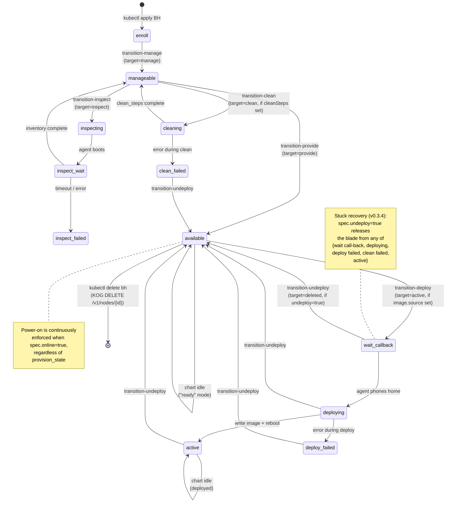

# BaremetalHost composition — user guide

Drive a bare-metal blade through Ironic's lifecycle with a single
`composition.krateo.io/v0-3-4` BaremetalHost CR. The Krateo blueprint
re-renders on every reconcile; each transition fires automatically once
the gates match live Ironic state.

## The two layers, named

There is no Go controller in this repo. The lifecycle is driven by **two
Krateo components stacked on top of each other**, and it helps to keep
them straight in your head.

### Layer 1 — `ironic-operator-kog` (the primitives)

The KOG (Krateo Operator Generator) part. From an OpenAPI spec of the
Ironic REST API (`oas/ironic-*.yaml`) we declare `RestDefinition` CRs
(`manifests/restdefinition-*.yaml`). KOG's `oasgen-provider` consumes
those and generates one CRD + one `rest-dynamic-controller` per resource:

| CRD | Backed by | What 1 CR = |
|---|---|---|
| `nodes.baremetal.ogen.krateo.io` | `ironic-node-controller` | one Ironic node (CRUD on `/v1/nodes`) |
| `ports.baremetal.ogen.krateo.io` | `ironic-port-controller` | one Ironic port (CRUD on `/v1/ports`) |
| `nodeprovisions.baremetal.ogen.krateo.io` | `ironic-node-provision-controller` | one `PUT /v1/nodes/{id}/states/provision` (fires once per CR) |
| `nodepowers.baremetal.ogen.krateo.io` | `ironic-node-power-controller` | one `PUT /v1/nodes/{id}/states/power` (fires once per CR) |
| `portgroups.baremetal.ogen.krateo.io` | `ironic-port-controller` | one Ironic portgroup |
| `allocations.baremetal.ogen.krateo.io` | (generated) | one Ironic allocation |
| `deploytemplates.baremetal.ogen.krateo.io` | (generated) | one Ironic deploy template |

These are **primitives**, not a state machine. Each CR represents one
Ironic API call. There is no orchestration here — write a NodeProvision
with `target: active` and KOG fires the PUT exactly once. Write a Node CR
and KOG syncs it to Ironic via CRUD on `/v1/nodes`. The
`keystone-ironic-proxy` sits in front of every API call to handle
authentication + RFC-6902 JSON-Patch translation.

This layer is `ironic-operator-kog` (the name of this repo). It's a thin,
declarative wrapper over the Ironic REST API. You could use it on its
own — write your own orchestrator that creates the right NodeProvision
CRs in the right order. We chose not to write a controller; we chose
Layer 2.

### Layer 2 — the Krateo blueprint (the FSM driver)

The Krateo blueprint is **the `baremetal-host` chart + its
`CompositionDefinition`**, reconciled by `core-provider` and the
per-version `composition-dynamic-controller` (`cdc`).

```
CompositionDefinition: baremetal-host (in krateo-system)
   spec.chart.url: http://chartrepo.openstack.svc.cluster.local/baremetal-host-0.3.4.tgz
   spec.chart.version: "0.3.4"
                |
                | core-provider reads the chart, generates the BaremetalHost CRD,
                | spins up a cdc per chart version (e.g. baremetalhosts-v0-3-4-controller)
                v
BaremetalHost CR (in openstack ns) — what you write
   spec.nodeName, spec.image, spec.online, spec.undeploy, ...
                |
                | cdc reconciles every ~3 minutes (and on every BH CR change).
                | On each reconcile, cdc runs `helm template` with the BH spec
                | as values, then helm upgrades. Templates use `lookup` to read
                | live Ironic state via Layer 1's Node CR.
                v
Rendered Layer-1 CRs (in openstack ns)
   Node + Port + NodeProvision (one per current transition) + NodePower
                |
                | KOG-RDC fires the API calls (one PUT per NodeProvision/NodePower,
                | CRUD on Node + Port). keystone-ironic-proxy translates + auths.
                v
Ironic REST API
                |
                | state changes: enroll → manageable → ... → active
                v
Layer 1 Node CR's status updates with the new provision_state
                |
                | next cdc reconcile reads it via `lookup` → renders next transition
```

The FSM is **declared in the chart's seven `templates/transition-*.yaml`
files**. Each template is one edge of the state machine, gated on a Helm
`lookup` of the current Ironic state. cdc's continuous re-rendering is
what makes this a *machine* and not a static rendering — the chart is
re-evaluated on every reconcile, gates re-evaluated against live state,
transitions appear and disappear as state evolves.

**Read this twice if it didn't click**: there is no Go code orchestrating
anything. core-provider does its standard "render the chart, apply the
diff" job; the chart's templates *are* the state machine, expressed in
Helm conditionals. Each NodeProvision CR rendered is an API call about
to fire via the KOG primitive layer.

## State machine



Each `transition-*.yaml` template renders **only when its gate matches**, so the
chart never wedges itself — when the live Ironic state doesn't match any
transition's prerequisites, nothing renders, cdc reconcile is a no-op. The chart
is idle by design, not by accident.

## Quickstart

A minimal BaremetalHost that walks a blade enroll → active with cloud-init:

```yaml
apiVersion: composition.krateo.io/v0-3-4
kind: BaremetalHost
metadata:
  name: blade01
  namespace: openstack
spec:
  nodeName: blade01
  nodeUuid: 11111111-2222-3333-4444-555555555555
  driver: redfish
  driver_info:
    redfish_address: http://192.168.0.10:8000
    redfish_username: ironic
    redfish_password: baremetal
    redfish_system_id: /redfish/v1/Systems/blade01
  ports:
    - address: "00:60:2f:01:81:01"
      pxe_enabled: true
    - address: "00:60:2f:01:81:02"
      pxe_enabled: false
  enableInspection: true
  image:
    source: http://images.local/debian-13.qcow2
    checksum: http://images.local/CHECKSUM
  configDrive:
    metaData:
      hostname: blade01
    userData: |
      #cloud-config
      ssh_pwauth: true
      users:
        - name: ops
          plain_text_passwd: ops
          sudo:
            - "ALL=(ALL) NOPASSWD:ALL"
  online: true
```

```bash
kubectl apply -f bh.yaml
kubectl get bh blade01 -w
```

Walks enroll → manageable → inspecting → manageable → provide → available →
deploy → active in ~15 min on real Redfish + virtual-media hardware.

## The spec, one section at a time

### Identity + BMC

```yaml
spec:
  nodeName: blade01                          # required — Ironic node name
  nodeUuid: 11111111-...                     # optional but recommended (stable across re-enroll)
  parentNode: 5113ab44-...                   # optional — enclosure UUID, if applicable
  driver: redfish                            # or ipmi, fake-hardware
  driver_info:                               # driver-specific (redfish_* / ipmi_* keys)
    redfish_address: http://...
    redfish_username: ironic
    redfish_password: baremetal
    redfish_system_id: /redfish/v1/Systems/blade01
```

The chart proxies these to `node.driver_info` on the Ironic node. The
keystone-ironic-proxy uses your `clouds.yaml` to authenticate — credentials
*here* are the BMC's, not Ironic's.

### Ports

```yaml
spec:
  ports:
    - address: "00:60:2f:01:81:01"
      pxe_enabled: true
    - address: "00:60:2f:01:81:02"
      pxe_enabled: false
```

One Port CR is created per entry. **The PXE-enabled port must boot from network**
— Ironic writes `pxelinux.cfg/<MAC>` only when deploy starts, so the port must
already exist on the Ironic side. The chart handles that ordering.

### Inspection

```yaml
spec:
  enableInspection: true
```

After the first walk through `manageable`, the chart fires `target: inspect`.
Ironic boots an IPA inspector via PXE/virtual-media, the agent gathers
inventory, results land in `status.properties` on the Node CR plus
`status.inspection_finished_at`. Subsequent reconciles skip the inspect
transition because `inspection_finished_at` is now populated.

To force re-inspection: clear `status.inspection_finished_at` via direct Ironic
API call. The chart doesn't expose this as a spec field; it's a rare operation.

### Deploy

```yaml
spec:
  image:
    source: http://images.local/debian-13.qcow2
    checksum: http://images.local/CHECKSUM
    checksum_type: sha256       # optional
    format: qcow2               # optional
    root_device:                # optional disk-selection hints
      wwn: 0x5000c500...
      serial: "..."
      size: 500
```

When `image.source` is set and `provision_state == available` and
`spec.undeploy != true`, `transition-deploy.yaml` renders a NodeProvision with
`target: active` and the assembled configdrive. KOG fires the PUT, Ironic
deploys (~3-5 min on cached IPA agent).

### Configdrive

```yaml
spec:
  configDrive:
    metaData:
      uuid: <node-uuid>          # cloud-init reads as instance-id
      hostname: blade01
    userData: |
      #cloud-config
      ssh_pwauth: true
      users: [...]
      runcmd:
        - touch /etc/cfgdrive-applied
    networkData:
      links:
        - id: enp1s0
          type: phy
          ethernet_mac_address: "00:60:2f:01:81:01"
      networks:
        - id: enp1s0
          network_id: enp1s0
          type: ipv4_dhcp
          link: enp1s0
      services:
        - type: dns
          address: "8.8.8.8"
```

The chart converts this to the canonical Ironic shape
`instance_info.configdrive = {meta_data, user_data, network_data}`, which
Ironic assembles into an ISO9660 image at deploy time. cloud-init mounts the
`config-2` partition on first boot and applies the layout.

Validated end-to-end via SSH (see `docs/TEST-PLAN.md` gap 1+2):
hostname, users, runcmd effects all confirmed on the deployed OS.

### Undeploy (release the blade)

```yaml
spec:
  undeploy: true
  undeployMode: full   # or none
```

`spec.undeploy: true` is a state-agnostic release signal. The chart's
`transition-undeploy.yaml` gate fires from any of:
`{active, deploy failed, clean failed, wait call-back, deploying}`. It drives
Ironic through `target: deleted` → cleaning (or skip) → available.

| `undeployMode` | What Ironic does between deleted and available |
|---|---|
| `full` (default) | runs the standard clean_steps (disk erase, RAID reset, etc.) via IPA agent — slow but safe (no tenant data leaks) |
| `none` | sets `spec.automated_clean: false` on the Node CR; Ironic skips the IPA-boot cleaning. **Disks keep tenant data.** Use only in private labs / fast test cycles |

Verified timings (real hardware, configdrive on a debian-13 image):
- `mode: full` — 4m11s (cleaning pass writes through the disks)
- `mode: none` — 6s (no IPA boot)

Once at `available`, clear `undeploy` to re-deploy with the current `image`:

```bash
kubectl patch bh blade01 --type=merge -p='{"spec":{"undeploy":false}}'
```

### Image swap

```bash
# 1. release the blade
kubectl patch bh blade01 --type=merge -p='{"spec":{"undeploy":true}}'
# wait for `provision_state: available`

# 2. swap image + clear undeploy
kubectl patch bh blade01 --type=merge -p='{"spec":{
  "image":{"source":"http://images.local/ubuntu-22.qcow2","checksum":"..."},
  "undeploy":false
}}'
```

Composition handles the rest. Total time ≈ `undeployMode` walk + ~3 min deploy.

### Power

```yaml
spec:
  online: true   # or false
```

Continuously enforced via the `transition-power.yaml` rename pattern. When the
live `power_state` doesn't match `online`, the chart renames the NodePower CR
(name encodes target + observed), KOG fires PUT power-on/off, BMC complies.
Tracks BMC flaps and corrects on the next reconcile.

If `online` is unset, the chart doesn't manage power (Ironic's natural state
applies).

### Maintenance + detached

```yaml
spec:
  maintenance: true    # Ironic stops auto-actions (power monitoring, etc.)
  detached: true       # chart skips ALL transitions — Node + Port CRs stay,
                       # nothing else fires. Use to hand off control.
```

### Clean steps (BIOS / RAID / firmware)

```yaml
spec:
  cleanSteps:
    - interface: raid
      step: create_configuration
      args:
        logical_disks:
          # driver-specific shape (size, raid_level, ...)
    - interface: bios
      step: apply_configuration
      args:
        settings:
          # driver-specific shape (name, value, ...)
```

Fired during `cleaning` (manageable → clean → manageable). The shape is raw
Ironic clean_steps — no typed abstraction. Look at your driver's
`get_clean_steps` for what's supported.

## Lifecycle recipes

### Park a blade at `available` (no deploy)

```yaml
spec:
  enableInspection: true
  online: true
  # no image.source — chart stops at available
```

### Deploy + verify cloud-init via SSH

```yaml
spec:
  configDrive:
    userData: |
      #cloud-config
      ssh_pwauth: true
      users:
        - name: ops
          plain_text_passwd: ops
          sudo: ['ALL=(ALL) NOPASSWD:ALL']
  image:
    source: http://images.local/debian-13.qcow2
    checksum: http://images.local/CHECKSUM
```

After active, the blade gets a DHCP lease (typically two — one per NIC). Find
the IP via your DHCP server's leases file, dome's ARP table, or scan the deploy
network. SSH as `ops` with password `ops`.

### Release for maintenance, then put back into service

```bash
# release
kubectl patch bh blade01 --type=merge -p='{"spec":{"undeploy":true}}'
# physical maintenance happens
# put back
kubectl patch bh blade01 --type=merge -p='{"spec":{"undeploy":false}}'
```

If you also want to remove it from k8s tracking entirely:

```bash
# release first (mandatory — see warning below)
kubectl patch bh blade01 --type=merge -p='{"spec":{"undeploy":true}}'
# once at available
kubectl delete bh blade01    # KOG's DELETE /v1/nodes/{id} succeeds (no 409)
```

### Recover from a stuck deploy

```bash
# spec.undeploy=true from wait call-back, deploying, deploy failed, or clean failed
# walks the blade back to available — ~45 s on the lab Ironic in the verified test
kubectl patch bh blade01 --type=merge -p='{"spec":{"undeploy":true}}'
```

This is v0.3.4's main improvement over the original design. See `docs/TEST-PLAN.md`
test 4.1 STATUS section.

## What NOT to do

### Don't `kubectl delete bh` while blade is at `active`

cdc's delete path is `helm uninstall` — it doesn't re-render the chart and
doesn't drive a state-machine walk. With Ironic at `active`, KOG's
`DELETE /v1/nodes/{id}` returns 409 ("can't delete an active node"), the BH CR
disappears from k8s, and **the Ironic node stays at `active` orphaned forever**
(until you intervene out of band). See `docs/TEST-PLAN.md` gap 3 — we
empirically reproduced this.

Always `spec.undeploy: true` first.

### Don't `kubectl patch` finalizers off a BH while cdc is mid-reconcile

You'll strand the rendered Node/Port CRs with helm-ownership annotations from
the old release; the next `kubectl apply` will hit
`invalid ownership metadata` from chart-inspector. Recovery procedure is at
`docs/ORPHAN-RECOVERY.md`. Better: don't trigger it.

### Don't fake an image swap by toggling `?v=2` query strings

The test plan's "no-image-source-toggle" guidance applies operationally too —
the deployed bytes don't change, but the chart's `lookup` thinks something
shifted and the apparent state diverges from disk reality. Use a genuinely
different qcow2 if you want a real swap. If you want to re-trigger cloud-init
on the same image, undeploy + re-deploy explicitly.

### Don't delete the `CompositionDefinition` while BHs exist

The cascade deletes the BH CRD. If any BH instance has stuck finalizers,
the CRD enters Terminating and kube-apiserver's GC keeps trying to delete
the CR every 60 seconds. New CRs come and go on a 60-second cycle until you
clean up. See the session memory file
`reference_krateo-cd-stuck-crd-finalizer.md`.

## Troubleshooting

### State machine not progressing

Check the Node CR's status condition first:

```bash
kubectl -n openstack get node.baremetal.ogen.krateo.io blade01 \
  -o jsonpath='{.status.conditions}'
```

If you see `Synced=ReconcileError`, status updates stop, lookup stalls, the
chart can't progress.

### NodeProvision firing the PUT repeatedly

It shouldn't. The 202 response sets `status.conditions[Ready]=Pending` which
guards re-fire. If it's looping, check the OAS for the provision endpoint —
the 202 response code must be declared.

### `kubectl apply` returns `Warning: unknown field "spec.X"`

The version you applied at doesn't have field X in its schema. Re-apply at
`composition.krateo.io/v0-3-4` (or whichever is current). See the README's
"Multi-version CompositionDefinitions" section.

### `helm get values` shows defaults for fields you set

Same root cause as above — the apiVersion you applied at stripped your field
at write time. Re-apply at the current apiVersion; `vacuum` storage preserves
what you write.

### chart-inspector returns 500 with "invalid ownership metadata"

Orphan-release residue from a prior cycle. Follow `docs/ORPHAN-RECOVERY.md`.

### Blade stuck at `wait call-back` after a BMC hiccup

```bash
kubectl patch bh blade01 --type=merge -p='{"spec":{"undeploy":true}}'
```

The v0.3.4 widened undeploy gate handles this. Recovery time observed: 45s.

## Reference

- Chart source: `charts/baremetal-host/`
- State-machine templates: `charts/baremetal-host/templates/transition-*.yaml`
- Values schema (what's in spec): `charts/baremetal-host/values.schema.json`
- CompositionDefinition: `manifests/compositiondefinition-baremetal-host.yaml`
- Example manifests: `manifests/baremetalhost-blade*.yaml`
- Test plan and validation status: `docs/TEST-PLAN.md`
- Orphan-recovery procedure: `docs/ORPHAN-RECOVERY.md`
- Comparison vs metal3: `docs/VS-METAL3.md`

---

# Cluster ingress (for the `kubernetes-cluster` blueprint)

This section applies when you're using the `kubernetes-cluster` chart
to bootstrap a kubeadm cluster on top of the BaremetalHosts. The CP's
cloud-init publishes the join command into its own Node CR via
`kubectl patch` against the **management cluster's apiserver**, which
means each blade has to reach that apiserver from the provisioning
network. Pick one option below, set the address on
`spec.managementCluster.apiUrl` AND `spec.controlPlane.endpoint` (HA),
and record the choice on `spec.network.managementApiReachability` so
future tooling can branch on it.

### Option matrix

| Option | Infra cost | When it fits | HA failover |
|---|---|---|---|
| `external-lb` | F5 / HAProxy / cloud LB owns 6443 in front of the management apiservers. Operator-provided. | Production / enterprise default. | LB handles it. |
| `metallb` | MetalLB installed on the management cluster, with L2 or BGP advertised into the provisioning network. | Lab + small prod where blades share L2 with the management nodes. | Active/passive via L2 election. |
| `kube-vip` | A static-pod `kube-vip` DaemonSet baked into the **bare-metal CP cloud-init** that VIP-balances ITS OWN cluster's apiserver (does not solve management-cluster reachability — covered for completeness because some users conflate it). | NOT what this section is about; listed to disambiguate. | n/a |
| `nodeport-dns` | Expose management apiserver via NodePort on every management node, fronted by a DNS round-robin record. | Single-CP dev/PoC only. | None — DNS RR isn't real failover. |

### Constraint enforced by kubeadm

From the kubeadm HA docs:

> *"Make sure the address of the load balancer always matches the address of kubeadm's `ControlPlaneEndpoint`."*

So whatever you pick, `spec.controlPlane.endpoint` (advertised to
`kubeadm init --control-plane-endpoint=...`) must equal the address
the blades can reach. The MVP scaffold defaults `endpoint` to empty
(`""`), which is acceptable for single-CP. For Milestone 1's HA path,
making this consistent with the LB choice is a hard requirement.

### CA bundle

Since chart v0.2.0 the chart `lookup`s the auto-projected
`kube-root-ca.crt` ConfigMap in the SA namespace
(root-ca-cert-publisher controller, k8s 1.20+) and writes it into the
CP's cloud-init. You don't need to paste a PEM into the CR. The
`managementCluster.caBundle` value is preserved as an escape hatch for
hardened management clusters where root-ca-cert-publisher is disabled.

If neither path produces a CA bundle, the `lifecycle-cp.yaml` template
gate fails closed — no `BaremetalLifecycle` CR is rendered for the CP,
so the cloud-init doesn't get baked with a broken `publish-join.sh`.

## Token rotation (kubeadm join TTL)

`kubeadm init` mints a bootstrap token with a 24h TTL. Past that, any
worker still trying to join with the original token sees `InvalidToken`
and the chart's worker render gate keeps firing fresh attempts against
a dead token. Since chart v0.3.0 the CP cloud-init installs a systemd
timer (`kubeadm-token-refresh.timer`) that fires every 12h, re-runs
`publish-join.sh`, and PATCHes a fresh 24h token into
`Node.spec.extra.kubeadm_join`. The 12h cadence is a 50% margin against
the TTL — a missed refresh still leaves a valid window before workers
fail.

### What's verified

The refresher emits to journald with tag `kubeadm-token-refresh`. To
check it's healthy:

```bash
ssh root@<cp-blade> journalctl -t kubeadm-token-refresh --since "1 day ago"
ssh root@<cp-blade> systemctl list-timers kubeadm-token-refresh.timer
```

### What happens if the refresher dies

If the timer never fires (clock skew past TTL, blade hung, networking
outage to the management apiserver longer than the refresher's retry
window), the published token expires. **The CP itself keeps running**
— it's just that *new* workers can't join. The recovery path is the
same as for any irrecoverable CP-side issue: drive the CP through the
v0.3.4 widened `BaremetalHost.spec.undeploy: true` → re-deploy gate.
The new cloud-init carries the same refresher unit, so the rotation
resumes on the rebuilt CP.

This is the load-bearing reuse for token rotation: the chart never
implements a new "re-mint" CR or controller — it relies on
`baremetal-host`'s undeploy/redeploy gate as the failure-recovery
mechanism.

## Drain and delete a worker

Removing a worker from a `KubernetesCluster` is a three-phase flow,
all gated by Helm `lookup`:

1. **Move the entry from `spec.workers.nodes` to `spec.workers.removed`.**
   Same shape; you can add `undeployMode: full` (default) or `none` for
   the fast/dirty path (requires `baremetal:node:disable_cleaning` policy).

   ```bash
   kubectl patch kubernetescluster lab --type=json -p '[
     {"op":"remove","path":"/spec/workers/nodes/1"},
     {"op":"add","path":"/spec/workers/removed","value":[{
       "nodeName":"blade04",
       "driver":"redfish",
       "driver_info":{"redfish_address":"http://192.168.0.13:8000"}
     }]}
   ]'
   ```

2. **Chart renders a drain `Job` against the workload apiserver.** Named
   `drain-<clusterName>-<nodeName>`, mounts the workload kubeconfig from
   the `<clusterName>-workload-kubeconfig` Secret (published by the CP
   at first boot), runs `kubectl drain <node> --ignore-daemonsets
   --delete-emptydir-data --timeout=<spec.workers.drainTimeout>`. Watch
   it:

   ```bash
   kubectl -n openstack get job -l \
     kubernetescluster.ogen.krateo.io/role=drain
   kubectl -n openstack logs -l \
     kubernetescluster.ogen.krateo.io/role=drain --tail=200
   ```

3. **Once the drain Job's `status.succeeded == 1`, the chart re-renders
   the worker's BaremetalHost with `spec.undeploy: true`.** This uses
   the v0.3.4 widened undeploy gate from `charts/baremetal-host`
   ({active, deploy failed, clean failed, wait call-back, deploying}),
   walking the blade through Ironic's clean cycle back to `available`.

4. **Once the BH reports `available`, remove the entry from `removed`.**
   cdc stops rendering the BH; helm deletes it; KOG fires `DELETE`
   against Ironic. The Ironic node is removed.

```bash
# When you see provision_state=available on the removed blade
kubectl -n openstack get node.baremetal.ogen.krateo.io blade04 \
  -o jsonpath='{.status.provision_state}{"\n"}'
# -> available

# Drop the entry to finish cleanup
kubectl patch kubernetescluster lab --type=json -p '[
  {"op":"replace","path":"/spec/workers/removed","value":[]}
]'
```

### Why drain Jobs and not the CP itself

The CP has `admin.conf` locally — it could run drain in-blade. But the
chart's FSM lives on the management cluster; gating worker undeploy on
the in-blade drain finishing would require yet another rendezvous
channel (back into `Node.spec.extra`). Instead the chart publishes the
workload kubeconfig as a Secret in the lifecycle namespace, and a
short-lived Job on the management cluster does the drain. Same
FSM-via-`lookup` idiom, no new rendezvous keys.

### What can go wrong

- **PodDisruptionBudget blocks drain indefinitely.** `kubectl drain`
  respects PDBs and waits. The Job times out at `drainTimeout` (default
  5m). Bump it, or evict the PDB-protected pods manually.
- **Workload kubeconfig Secret missing.** The CP's
  `publish-workload-kubeconfig.sh` only runs once at first boot. If it
  failed (mgmt API unreachable, CA mismatch), no drain Job will render.
  Recovery: drive the CP through `BaremetalHost.spec.undeploy: true` →
  re-deploy; the new cloud-init re-runs the publish.
- **Worker is in `deploy failed` or `wait call-back`.** The v0.3.4
  widened gate covers these. The drain Job will still try; if the
  workload kubelet is down it'll fail. Operator-level decision: skip
  the drain (manually delete the Job) and let the BH `spec.undeploy: true`
  fire anyway. The chart doesn't force the drain step.

## HA control plane (stacked etcd)

Single-CP is fine for dev / lab. Production wants 3 (or 5) CPs with
stacked etcd. Chart v0.5.0 supports this via `spec.controlPlane.nodes[]`:

```yaml
spec:
  controlPlane:
    # Stable apiserver endpoint — REQUIRED for HA, must point at a
    # load-balanced VIP (see "Cluster ingress" above for options).
    endpoint: lab-api.example.com:6443
    nodes:
      # Index 0 = bootstrap CP. Runs `kubeadm init --upload-certs
      # --certificate-key=<key>` and publishes BOTH kubeadm_join AND
      # cert_key into its own Node.spec.extra.
      - nodeName: blade06
        nodeUuid: 2f05176e-4531-4a90-a3bd-eda84b517d57
        driver: redfish
        driver_info: {...}
      # Indices 1..N-1 = replica CPs. Gated by Helm `lookup` on both
      # the bootstrap's `Node.spec.extra.kubeadm_join` and
      # `Node.spec.extra.cert_key`. Render `kubeadm join <endpoint>
      # --control-plane --certificate-key <key>`.
      - nodeName: blade07
        nodeUuid: ...
        driver: redfish
        driver_info: {...}
      - nodeName: blade08
        nodeUuid: ...
        driver: redfish
        driver_info: {...}
```

The legacy `controlPlane.node` shape is still accepted for single-CP
back-compat (ignored when `nodes[]` is set).

### Why bootstrap-CP always uses `--upload-certs`

Even for single-CP, the chart runs `kubeadm init --upload-certs
--certificate-key=$(openssl rand -hex 32)`. Reason: promoting to HA
later becomes a pure values change (add entries to
`spec.controlPlane.nodes[]`) rather than rebuilding the CP. The
uploaded certs are stored in the `kubeadm-certs` Secret on the workload
cluster; the CP's `publish-join.sh` also writes `cert_key` into the
bootstrap's `Node.spec.extra.cert_key` so the chart's `certKey` lookup
can find it.

### The 2-hour cert-key TTL

From the kubeadm HA docs:

> *"Please note that the certificate-key gives access to cluster
> sensitive data, keep it secret! As a safeguard, uploaded-certs will
> be deleted in two hours; If necessary, you can use `kubeadm init
> phase upload-certs` to reload certs afterward."*

If a replica CP `BaremetalHost` doesn't deploy within 2h of the
bootstrap CP publishing, the `kubeadm join --control-plane` will fail
with "unable to fetch the kubeadm-certs Secret". Recovery (any healthy
CP, manual today, automatable in a follow-up):

```bash
# On a healthy CP
NEW_KEY=$(openssl rand -hex 32)
kubeadm init phase upload-certs --upload-certs \
  --certificate-key="$NEW_KEY"

# Patch the bootstrap CP's Node CR (the rendezvous) so the chart
# `lookup` picks up the new key on next reconcile
kubectl -n openstack patch node.baremetal.ogen.krateo.io blade06 \
  --type=merge \
  -p "{\"spec\":{\"extra\":{\"cert_key\":\"$NEW_KEY\"}}}"
```

Then cdc re-renders the replica CP BHs with the new key. If a replica
was mid-deploy when the key expired, drive it through `spec.undeploy:
true` → re-deploy (the v0.3.4 widened gate handles all the stuck
states the failed join leaves).

## k8s upgrade by-reimage

Cloud-init only runs at first boot — there's no way for the chart to
in-place upgrade a deployed node. Upgrade-by-reimage uses
`baremetal-host`'s widened `spec.undeploy: true` gate (v0.3.4) to walk
each CP/worker through `available` and back through deploy with new
cloud-init carrying the bumped version.

### Recipe (CP-by-CP, one at a time)

From the kubeadm docs:

> *"The upgrade workflow at high level is the following: 1. Upgrade a
> primary control plane node. 2. Upgrade additional control plane nodes.
> 3. Upgrade worker nodes."*

> *"The upgrade procedure on control plane nodes should be executed one
> node at a time."*

```bash
# 1. Bump the cluster's target version.
kubectl patch kubernetescluster ettore --type=merge \
  -p '{"spec":{"k8sVersion":"v1.31.5"}}'

# 2. Pin the first CP for upgrade. The chart re-renders its
#    BaremetalHost with spec.undeploy: true.
kubectl patch kubernetescluster ettore --type=merge \
  -p '{"spec":{"controlPlane":{"upgrade":{"targetNode":"blade06"}}}}'

# 3. Wait for Ironic to walk the blade to available.
watch "kubectl -n openstack get node.baremetal.ogen.krateo.io blade06 \
  -o jsonpath='{.status.provision_state}'"
# -> available

# 4. Clear the upgrade target. The chart re-renders the BH for deploy,
#    cloud-init runs with the new k8sVersion baked in.
kubectl patch kubernetescluster ettore --type=merge \
  -p '{"spec":{"controlPlane":{"upgrade":{"targetNode":""}}}}'

# 5. Wait for the BH back at active and the node Ready in the workload
#    cluster. Then move to the next CP.
```

### Worker upgrade

Workers use the same model, via `workers.removed[]`: move the worker to
`removed`, drain Job runs, undeploy walks it to `available`, then move
back into `workers.nodes[]` so the chart redeploys with the new
`k8sVersion`.

### Caveats

- **Single-CP clusters lose etcd state** every upgrade. Use HA
  (3 CPs) to keep etcd up across CP reimages.
- **Skew rule**: kubelet may lag apiserver by 3 minor versions. The
  runbook enforces CP-before-worker ordering implicitly because workers'
  cloud-init pulls the new version only on their own
  undeploy/redeploy cycle.
- **CNI re-init**: the bootstrap CP also re-applies the CNI manifest on
  every fresh deploy (`KUBECONFIG=admin.conf kubectl apply -f
  flannel.yaml`). Don't `spec.cni.manifestUrl`-version-lock to something
  that disagrees with the new kubelet's CNI API.

## Recovering a failed control plane

Single-CP recovery means data loss (no etcd backup, no replicas to
copy from). Don't run single-CP in production; use the HA shape from
the previous section. For HA, the recovery flow leans on the v0.3.4
widened `spec.undeploy: true` gate (covers `deploy failed`,
`wait call-back`, `clean failed`, `deploying`).

### Pre-flight: etcd member remove (manual)

This MUST run before moving the entry into `recovery.failedNodes[]` —
otherwise the rejoin will fail with "member already exists". From a
healthy CP:

```bash
# inside any healthy CP container
ETCDCTL_API=3 etcdctl --endpoints=https://127.0.0.1:2379 \
  --cacert=/etc/kubernetes/pki/etcd/ca.crt \
  --cert=/etc/kubernetes/pki/etcd/server.crt \
  --key=/etc/kubernetes/pki/etcd/server.key \
  member list

# Find the member ID for the failed CP. Then:
ETCDCTL_API=3 etcdctl member remove <member-id>
```

From the etcd docs:

> *"Suppose the member ID to remove is a8266ecf031671f3. Use the `remove`
> command to perform the removal: `etcdctl member remove a8266ecf031671f3`."*

### Drive the BH through undeploy

```bash
# Move the failed CP entry from .nodes[] into .recovery.failedNodes[]
kubectl patch kubernetescluster ettore --type=json -p '[
  {"op":"remove","path":"/spec/controlPlane/nodes/2"},
  {"op":"add","path":"/spec/controlPlane/recovery/failedNodes","value":[{
    "nodeName":"blade08",
    "driver":"redfish",
    "driver_info":{"redfish_address":"http://172.19.74.11:8000"}
  }]}
]'

# Chart renders the BH with spec.undeploy: true. Watch:
kubectl -n openstack get node.baremetal.ogen.krateo.io blade08 \
  -o jsonpath='{.status.provision_state}'
# active -> deleted -> cleaning -> available
```

### Rejoin as a replica

```bash
# Move the entry back into .nodes[] at a REPLICA index (not 0 — the
# bootstrap CP is still bootstrap; recovered nodes always rejoin as
# replicas via --control-plane --certificate-key).
kubectl patch kubernetescluster ettore --type=json -p '[
  {"op":"replace","path":"/spec/controlPlane/recovery/failedNodes","value":[]},
  {"op":"add","path":"/spec/controlPlane/nodes/-","value":{
    "nodeName":"blade08",
    "driver":"redfish",
    "driver_info":{...},
    "ports":[...]
  }}
]'
```

The chart's `lifecycle-cp-replicas.yaml` template renders a BH that
runs `kubeadm join --control-plane --certificate-key <key>`. If
cert-key TTL (2h) has expired since the bootstrap CP's last upload,
rotate it (see "HA control plane" → "The 2-hour cert-key TTL" above).

### Manual cert distribution alternative

From kubeadm HA docs:

> *"If instead, you prefer to copy certs across control-plane nodes
> manually or using automation tools, please remove this flag and
> refer to Manual certificate distribution section below."*

The chart sticks with `--upload-certs` for simplicity; manual cert
distribution would require a chart fork or out-of-band copy step.

## Deploying on the Ettore lab (real bare-metal recipe)

A turn-key manifest for the Ettore lab lives at
[`manifests/kubernetescluster-ettore-lab.yaml`](../manifests/kubernetescluster-ettore-lab.yaml)
— CP on blade06 + worker on blade10, with the real Redfish credentials
and UUIDs from the existing baremetalhost-blade06-power-flip.yaml and
baremetalhost-blade10-inspect-fail.yaml fixtures.

### Pre-deploy

1. **Pick the management API reachability** (`external-lb` / `metallb`
   / `kube-vip` / `nodeport-dns`) and set `spec.managementCluster.apiUrl`
   to the matching address the blades can actually reach. The
   placeholder in the manifest assumes `nodeport-dns` on the lab
   gateway (`172.19.74.1:30443`); replace with the real value.

2. **Delete the existing BHs that fight on `nodeName`.** The chart's
   BHs are named `ettore-cp-blade06` and `ettore-worker-blade10`, but
   they share `spec.nodeName` with whatever fixtures are already
   managing those blades:

   ```bash
   kubectl --kubeconfig local/kubeconfig.ironic-lab \
     --context kind-ironic-lab -n openstack \
     delete baremetalhost blade06 blade10 --wait=true
   ```

3. **Do NOT touch blade04** — Gap-9 24h soak in progress.

### Deploy

```bash
kubectl --kubeconfig local/kubeconfig.ironic-lab \
  --context kind-ironic-lab \
  apply -f manifests/kubernetescluster-ettore-lab.yaml
```

Then watch:

```bash
kubectl -n openstack get kubernetescluster ettore -o jsonpath='{.status.conditions}'
kubectl -n openstack get baremetalhost -l \
  kubernetescluster.ogen.krateo.io/cluster=ettore
kubectl -n openstack get node.baremetal.ogen.krateo.io blade06 \
  -o jsonpath='{.status.provision_state}{"\n"}'
kubectl -n openstack get node.baremetal.ogen.krateo.io blade06 \
  -o jsonpath='{.spec.extra.kubeadm_join}{"\n"}'
```

### What the smoke test validated (commit `<this>`)

A short fake-hardware smoke against the same chart confirmed end-to-end:

- KubernetesCluster CR accepted by core-provider → CRD `v0-4-0` served.
- cdc reconciled, helm-installed chart 0.4.0 from the in-cluster
  chartrepo.
- All 5 chart-managed resources rendered: ServiceAccount, token
  Secret, Role, RoleBinding, and the CP `BaremetalHost`.
- baremetal-host's cdc reconciled the rendered BH → created the Node
  CR + a `NodePower` for "power-on-from-unknown".
- The Node CR's `lookup` of `kube-root-ca.crt` returned the projected
  CA (Milestone 3 working).

The smoke stopped at Ironic POST because the production Ironic in this
lab has only `redfish`/`ipmi` enabled — the `fake-hardware` driver is
not in the enabled-drivers list. That's a lab config detail, not a
chart bug; the Ettore-lab manifest uses `redfish` end-to-end.

### What still needs validation on real hardware

- CP cloud-init reaching `managementCluster.apiUrl` for the publish
  steps (Milestone 2 network plumbing).
- `kubeadm init` actually forming a cluster (depends on image,
  containerd availability, kernel modules).
- Workers' `lookup` of `spec.extra.kubeadm_join` firing the join-flow.
- The `kubeadm-token-refresh.timer` cadence on a long-running CP.
- Drain Job's reachability to the workload apiserver.
