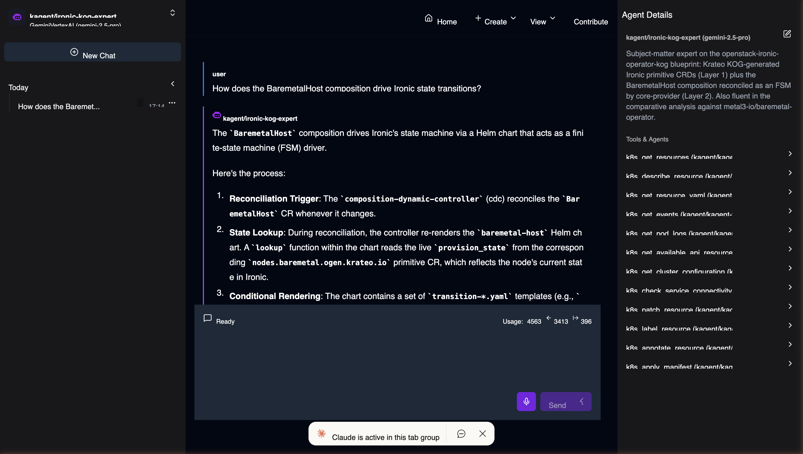

# kagent Agent: `ironic-kog-expert`

A [kagent](https://kagent.dev) Agent CRD that turns an LLM into a
subject-matter expert on this blueprint:

- The two-layer architecture (KOG-generated Ironic primitives + the
  `BaremetalHost` Helm chart reconciled as an FSM by Krateo core-provider).
- State-machine semantics, stuck-state recovery via `spec.undeploy`,
  `undeployMode=none` fast path.
- Comparison against `metal3-io/baremetal-operator` (see
  [`docs/VS-METAL3.md`](../docs/VS-METAL3.md)).

The system prompt embeds the non-obvious gotchas (port ordering, CRD
version stripping, stuck CRD finalizer, `system_scope:all` workaround,
no-manual-power-ops) and the triage recipe.

## What it looks like



The agent picks apart the FSM exactly the way the blueprint is wired:
`composition-dynamic-controller` reconciles the `BaremetalHost`, the chart
re-renders with a Helm `lookup` reading live `provision_state` from the
`nodes.baremetal.ogen.krateo.io` primitive, `transition-*.yaml` templates
gate on that state and render a `NodeProvision` / `NodePower` primitive
CR, and the Layer-1 `rest-dynamic-controller` for that primitive issues
the Ironic REST call. Right pane shows the wired-in `k8s_*` tools the
agent uses to inspect/patch resources on the cluster.

## Prerequisites

### 1. Install kagent

Pulled directly from the GHCR OCI registry — no `helm repo add` needed.
Verified working on kagent v0.9.6.

```bash
KCFG=local/kubeconfig.ironic-lab            # your isolated kubeconfig
KCTX=kind-ironic-lab                        # your cluster context

kubectl --kubeconfig "$KCFG" --context "$KCTX" \
  create ns kagent --dry-run=client -o yaml | \
  kubectl --kubeconfig "$KCFG" --context "$KCTX" apply -f -

helm --kubeconfig "$KCFG" --kube-context "$KCTX" \
  upgrade --install kagent-crds \
  oci://ghcr.io/kagent-dev/kagent/helm/kagent-crds \
  --version 0.9.6 --namespace kagent --wait --timeout 5m

helm --kubeconfig "$KCFG" --kube-context "$KCTX" \
  upgrade --install kagent \
  oci://ghcr.io/kagent-dev/kagent/helm/kagent \
  --version 0.9.6 --namespace kagent \
  --set providers.default=anthropic \
  --set providers.anthropic.model=claude-sonnet-4-6 \
  --timeout 10m
```

Swap `providers.default` for `openAI`, `gemini`, `azureOpenAI`, or
`ollama` if you want a non-Anthropic auto-`ModelConfig`. The chart
auto-creates a `ModelConfig` named `default-model-config` matching
whichever provider you pick.

### 2. ModelConfig: Gemini on Vertex AI (what this repo ships)

The Agent here references a `ModelConfig` named **`vertex-gemini`** of
kind `GeminiVertexAI` (see [`modelconfig-vertex-gemini.yaml`](./modelconfig-vertex-gemini.yaml)).
We use Vertex rather than the chart's auto-created provider so the
agent runs on GCP-managed Gemini with service-account auth.

**One-time GCP prep:**

1. Enable the Vertex AI API on your GCP project.
2. Create a service account (e.g. `kagent-vertex`) with role
   **`roles/aiplatform.user`** (displayed as "Agent Platform User" in
   the current GCP UI — same role ID, recent rebrand).
3. Download a JSON key for the service account.

**Create the secret** kagent will mount as `/creds/key.json`:

```bash
kubectl --kubeconfig "$KCFG" --context "$KCTX" \
  create secret generic kagent-vertex -n kagent \
  --from-file=key.json=$HOME/Downloads/<your-sa-key>.json
```

**Edit and apply the `ModelConfig`**, setting `projectID` and `location`
to your GCP project + region:

```bash
$EDITOR kagent/modelconfig-vertex-gemini.yaml   # set projectID and location
kubectl --kubeconfig "$KCFG" --context "$KCTX" \
  apply -f kagent/modelconfig-vertex-gemini.yaml
```

The kagent controller's translator auto-injects
`GOOGLE_CLOUD_PROJECT`, `GOOGLE_CLOUD_LOCATION`,
`GOOGLE_GENAI_USE_VERTEXAI=true`, and
`GOOGLE_APPLICATION_CREDENTIALS=/creds/key.json` into the agent pod, and
mounts the `kagent-vertex` secret as a volume at `/creds/`. No further
auth wiring required.

#### Alternative providers

| `spec.provider`     | secret name        | secret key            | notes                          |
|---------------------|--------------------|-----------------------|--------------------------------|
| `Anthropic`         | `kagent-anthropic` | `ANTHROPIC_API_KEY`   | direct Anthropic API           |
| `OpenAI`            | `kagent-openai`    | `OPENAI_API_KEY`      |                                |
| `Gemini`            | `kagent-gemini`    | `GOOGLE_API_KEY`      | AI Studio (not Vertex)         |
| `GeminiVertexAI`    | `kagent-vertex`    | `key.json` (file)     | this repo                      |
| `AnthropicVertexAI` | same shape         | `key.json` (file)     | Claude via Vertex Model Garden |

Edit `spec.declarative.modelConfig` in
[`agent-ironic-expert.yaml`](./agent-ironic-expert.yaml) if you swap
providers.

### 3. Built-in `kagent-tool-server`

Shipped automatically by the kagent helm chart as a `RemoteMCPServer`.
Provides the `k8s_*` tool family the Agent uses. No extra setup.

## Apply

```bash
kubectl --kubeconfig "$KCFG" --context "$KCTX" \
  apply -f kagent/agent-ironic-expert.yaml
kubectl --kubeconfig "$KCFG" --context "$KCTX" \
  -n kagent get agent ironic-kog-expert
```

Then open the kagent UI (or the A2A endpoint) and ask one of the example
prompts under `spec.declarative.a2aConfig.skills`:

- "How does the `BaremetalHost` composition drive Ironic state transitions?"
- "`blade07` has been in `wait call-back` for 20 minutes — what now?"
- "Why would I pick this over metal3?"
- "Walk me through the `spec.undeploy` widening introduced in v0.3.4."

## What the agent can do

- Read `BaremetalHost`, `Node`, `Port`, `NodeProvision`, `NodePower` CRs
  and explain the live FSM position.
- Patch `spec.undeploy`, `spec.online`, `spec.image` on a `BaremetalHost`
  to drive the FSM (with confirmation).
- Tail pod logs from `keystone-ironic-proxy` and the cdc when diagnosing
  reconciliation hangs.
- Cite the canonical docs (`USER-GUIDE.md`, `VS-METAL3.md`,
  `TEST-PLAN.md`, `ORPHAN-RECOVERY.md`) verbatim where relevant.

## What the agent will not do

- Curl Ironic power endpoints directly (always goes through `spec.online`).
- Recommend `kubectl delete bh <name>` on an `active` blade — it walks
  you through `spec.undeploy: true` first.
- Mock or invent Ironic state — it reads `provision_state` from the live
  `Node` CR via `k8s_get_resource_yaml`.
